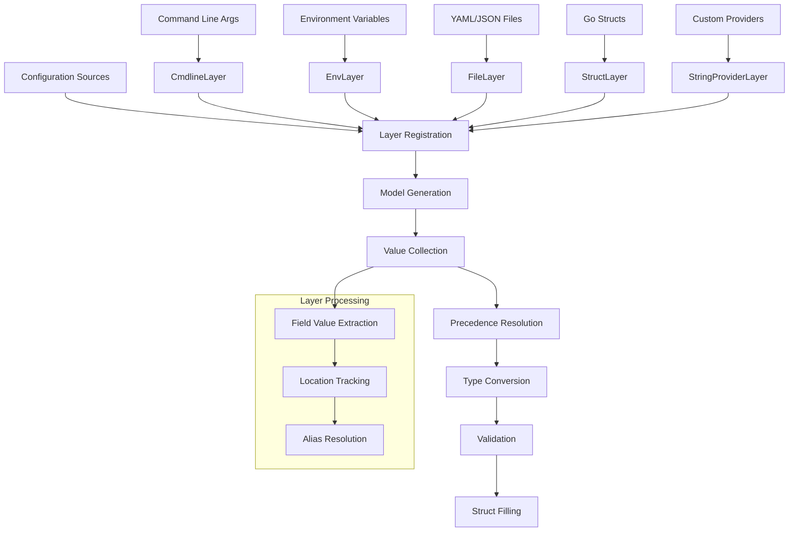

# dsco (pronounce /ˈdɪskoʊ/. Yes! as 70's music)

[](https://github.com/byte4ever/dsco/actions/workflows/go.yml)
[](https://pkg.go.dev/github.com/byte4ever/dsco)

[](https://goreportcard.com/report/github.com/byte4ever/dsco)

[](https://codeclimate.com/github/byte4ever/dsco/maintainability)
[](https://codeclimate.com/github/byte4ever/dsco/test_coverage)
[](https://codecov.io/gh/byte4ever/dsco)

[](https://github.com/byte4ever/dsco/)

[Français](README_fr.md) | English

A powerful Go configuration library that provides a layered configuration 
system supporting command line arguments, environment variables, YAML files, 
and struct-based configurations with strict validation.

## Table of Contents

- [Overview](#overview)
- [Project Motivations](#project-motivations)
- [Key Features](#key-features)
- [Installation](#installation)
- [Quick Start](#quick-start)
- [Architecture Overview](#architecture-overview)
- [Layer Types](#layer-types)
- [Configuration Struct Patterns](#configuration-struct-patterns)
- [Error Handling](#error-handling)
- [Advanced Usage](#advanced-usage)
- [API Reference](#api-reference)
- [Contributing](#contributing)
- [License](#license)

## Overview

dsco implements a layered configuration system where different configuration 
sources (command line, environment variables, files, structs) are organized 
into layers with configurable precedence. Later layers override earlier ones,
with optional strict mode for conflict detection.

## Project Motivations

### Safe Microservices Configuration

dsco was specifically designed to address critical configuration safety 
challenges in microservices environments where misconfiguration can lead to 
security vulnerabilities, service outages, or data corruption.

#### The Problem with Traditional Configuration

Traditional Go configuration approaches often suffer from:

- **Silent Defaults**: Values that appear configured but are actually using 
  hidden default values
- **Partial Configuration**: Services starting with incomplete configuration, 
  leading to runtime failures
- **Ambiguous State**: No clear distinction between "not configured" and 
  "configured with default value"
- **Configuration Drift**: Different environments having subtly different 
  configurations due to missing explicit values

#### The Pointer-Based Safety Design

dsco enforces **explicit configuration** through pointer-based fields:

```go
type DatabaseConfig struct {
    Host     *string `yaml:"host"`     // nil = not configured
    Port     *int    `yaml:"port"`     // nil = not configured  
    Timeout  *int    `yaml:"timeout"`  // nil = not configured
}

// SAFE: All values are explicitly provided
config := &DatabaseConfig{
    Host:    dsco.R("localhost"),
    Port:    dsco.R(5432),
    Timeout: dsco.R(30),
}

// UNSAFE: Would cause validation error - no ambiguity
config := &DatabaseConfig{
    Host: dsco.R("localhost"),
    // Port and Timeout are nil - clearly not configured
}
```

**Why Pointers Matter:**

1. **Explicit vs Implicit**: `nil` clearly means "not configured", while a 
   value means "explicitly configured"
2. **No Hidden Defaults**: Zero values (0, "", false) don't mask missing 
   configuration
3. **Validation Clarity**: The system can definitively identify missing 
   required configuration
4. **Microservice Safety**: Services fail fast with clear error messages 
   rather than running with dangerous defaults

#### Complete Configuration Requirement

dsco enforces that **all configuration must be complete and explicit**:

```go
// This will FAIL validation - incomplete configuration
var config *ServiceConfig
dsco.Fill(&config, 
    dsco.WithEnvLayer("SERVICE"),
    // Missing required fields will cause startup failure
)

// This will SUCCEED - all required fields explicitly provided
dsco.Fill(&config,
    dsco.WithEnvLayer("SERVICE"),
    dsco.WithStructLayer(&ServiceConfig{
        // Explicit defaults for all required fields
        Database: &DatabaseConfig{
            Host:    dsco.R("localhost"),
            Port:    dsco.R(5432),
            Timeout: dsco.R(30),
        },
        Server: &ServerConfig{
            Port:    dsco.R(8080),
            Timeout: dsco.R(60),
        },
    }, "defaults"),
)
```

#### Microservice Safety Benefits

1. **Fail-Fast Startup**: Services cannot start with incomplete configuration
2. **Environment Parity**: All environments must have explicitly defined 
   configuration
3. **Audit Trail**: Every configuration value has a clear source and location
4. **No Silent Failures**: Missing configuration causes immediate, clear errors
5. **Configuration Validation**: Built-in validation ensures configuration 
   completeness
6. **Layered Overrides**: Safe precedence rules prevent accidental 
   configuration conflicts

#### Real-World Example: Database Connection Safety

```go
type DatabaseConfig struct {
    Host     *string `yaml:"host"`
    Port     *int    `yaml:"port"`
    Username *string `yaml:"username"`
    Password *string `yaml:"password"`
    Database *string `yaml:"database"`
    SSLMode  *string `yaml:"ssl_mode"`
}

// Production service startup
_, err := dsco.Fill(&dbConfig,
    // Environment-specific overrides (highest priority)
    dsco.WithStrictEnvLayer("DB"),
    
    // Secret management system
    dsco.WithStringValueProvider(secretProvider),
    
    // Required base configuration (lowest priority)
    dsco.WithStrictStructLayer(&DatabaseConfig{
        Host:     dsco.R("postgres.prod.internal"),
        Port:     dsco.R(5432),
        Database: dsco.R("servicedb"),
        SSLMode:  dsco.R("require"),
        // Username and Password must come from higher layers
        // or service fails to start - no silent defaults!
    }, "base-config"),
)

if err != nil {
    // Service fails to start with clear error:
    // "field 'username' is not configured"
    // "field 'password' is not configured"
    log.Fatal("Configuration incomplete:", err)
}

// Service only starts with complete, explicit configuration
```

This approach ensures that microservices in production environments cannot 
start with missing critical configuration, preventing security issues and 
runtime failures that could affect the entire system.

## Key Features

- **Multi-source Configuration**: Command line args, environment variables, 
  YAML/JSON files, Go structs, and custom providers
- **Layered Priority System**: Configurable precedence with override control
- **Strict Mode**: Detect unused configuration values and conflicts
- **Type Safety**: Automatic type conversion with validation
- **Reflection-based**: Works with any Go struct using tags
- **Alias Support**: Define shortcuts for complex field paths
- **Error Aggregation**: Comprehensive error reporting with location tracking
- **Zero Dependencies**: Pure Go with minimal external requirements

## Installation

```bash
go get github.com/byte4ever/dsco
```

Requires Go 1.21 or later.

## Quick Start

### Basic Example

```go
package main

import (
    "fmt"
    "log"
    "time"

    "github.com/byte4ever/dsco"
)

// Configuration struct with pointer fields
type Config struct {
    Host     *string        `yaml:"host"`
    Port     *int           `yaml:"port"`
    Timeout  *time.Duration `yaml:"timeout"`
    Verbose  *bool          `yaml:"verbose"`
}

func main() {
    var config *Config

    // Fill configuration from multiple sources
    _, err := dsco.Fill(
        &config,
        dsco.WithCmdlineLayer(),
        dsco.WithEnvLayer("MYAPP"),
        dsco.WithStructLayer(&Config{
            Host:    dsco.R("localhost"),
            Port:    dsco.R(8080),
            Timeout: dsco.R(30 * time.Second),
            Verbose: dsco.R(false),
        }, "defaults"),
    )

    if err != nil {
        log.Fatal(err)
    }

    fmt.Printf("Server: %s:%d\n", *config.Host, *config.Port)
    fmt.Printf("Timeout: %v\n", *config.Timeout)
    fmt.Printf("Verbose: %t\n", *config.Verbose)
}
```

### Usage Examples

```bash
# Command line arguments
./myapp --host=production.com --port=9000

# Environment variables
MYAPP_HOST=production.com MYAPP_PORT=9000 ./myapp

# Combined (command line takes precedence)
MYAPP_HOST=staging.com ./myapp --host=production.com
```

## Architecture Overview

The dsco library implements a sophisticated layered configuration system:



### Configuration Flow

1. **Layer Registration**: Different configuration sources register as layers
2. **Model Generation**: Target struct is analyzed via reflection
3. **Value Collection**: Each layer provides field values from its source
4. **Precedence Resolution**: Later layers override earlier ones
5. **Type Conversion**: String values converted to target types via YAML
6. **Validation**: Required fields and custom validation applied
7. **Struct Filling**: Target struct populated with resolved values

## Layer Types

### Command Line Layers

```go
// Normal mode - unused flags ignored
dsco.WithCmdlineLayer()

// Strict mode - all flags must be used
dsco.WithStrictCmdlineLayer()

// With aliases
dsco.WithCmdlineLayer(
    dsco.WithAliases(map[string]string{
        "v": "verbose",
        "p": "port",
    }),
)
```

### Environment Variable Layers

```go
// Normal mode with prefix
dsco.WithEnvLayer("MYAPP")

// Strict mode - all matching env vars must be used
dsco.WithStrictEnvLayer("MYAPP")

// Multiple prefixes allowed
dsco.WithEnvLayer("MYAPP"),
dsco.WithEnvLayer("GLOBAL"),
```

**Environment Variable Mapping**:
- Field `Authentication.AccessToken` → `MYAPP_AUTHENTICATION_ACCESS_TOKEN`
- Nested structs use underscore separation
- Array indices: `Items[0].Name` → `MYAPP_ITEMS_0_NAME`

### Struct Layers

```go
// Default values (can be overridden)
dsco.WithStructLayer(&Config{
    Host: dsco.R("localhost"),
    Port: dsco.R(8080),
}, "defaults")

// Immutable values (strict mode)
dsco.WithStrictStructLayer(&Config{
    Host: dsco.R("production.com"),
}, "immutable")
```

### String Provider Layers

```go
// Custom provider implementation
type SecretProvider struct{}

func (s SecretProvider) GetName() string {
    return "secrets"
}

func (s SecretProvider) GetStringValues() svalue.Values {
    return svalue.Values{
        "database.password": svalue.Value{
            Value:    getSecretFromVault("db-password"),
            Location: svalue.NewLocation("vault", "db-password"),
        },
    }
}

// Usage
dsco.WithStringValueProvider(&SecretProvider{})
```

## Configuration Struct Patterns

Based on project conventions, configuration structs must follow specific 
patterns:

### Field Declaration Rules

```go
type DatabaseConfig struct {
    // All fields must be pointers (except slices/maps)
    Host     *string `yaml:"host" json:"host,omitempty"`
    Port     *int    `yaml:"port" json:"port,omitempty"`

    // Slices and maps can be non-pointer
    Tables   []string          `yaml:"tables" json:"tables,omitempty"`
    Options  map[string]string `yaml:"options" json:"options,omitempty"`

    // Extensive documentation required
    // Timeout specifies the maximum connection duration in seconds.
    // If nil, defaults to 30 seconds.
    // Example: 10
    Timeout *int `yaml:"timeout" json:"timeout,omitempty"`
}
```

### Provider Function Pattern

```go
func NewDatabasePool(config *DatabaseConfig) (*DatabasePool, error) {
    // 1. Validate configuration
    if err := validateConfig(config); err != nil {
        return nil, fmt.Errorf("invalid config: %w", err)
    }

    // 2. Create component
    pool := &DatabasePool{}

    // 3. Copy config if provided (embed, not pointer)
    if config != nil {
        pool.DatabaseConfig = *config
    }

    return pool, nil
}

func validateConfig(cfg *DatabaseConfig) error {
    if cfg == nil {
        return errors.New("config is nil")
    }
    if cfg.Host == nil {
        return errors.New("host must be defined")
    }
    if cfg.Port == nil || *cfg.Port < 1 || *cfg.Port > 65535 {
        return errors.New("port must be between 1 and 65535")
    }
    return nil
}
```

## Error Handling

### Error Types

dsco provides comprehensive error types with location information:

```go
// Layer registration errors
type LayerErrors struct {
    merror.MError
}

// Field value errors
type FillerErrors struct {
    merror.MError
}

// Specific error types
type InvalidInputError struct {
    Type reflect.Type
}

type CmdlineAlreadyUsedError struct {
    Index int
}

type OverriddenKeyError struct {
    Path             string
    Location         svalue.Location
    OverrideLocation svalue.Location
}
```

### Error Checking

```go
_, err := dsco.Fill(&config, layers...)
if err != nil {
    var layerErr LayerErrors
    if errors.As(err, &layerErr) {
        for _, e := range layerErr.Errors() {
            fmt.Printf("Layer error: %v\n", e)
        }
    }

    var fillerErr FillerErrors
    if errors.As(err, &fillerErr) {
        for _, e := range fillerErr.Errors() {
            fmt.Printf("Fill error: %v\n", e)
        }
    }
}
```

## Advanced Usage

### Strict Mode Example

```go
// All command line flags must be used
_, err := dsco.Fill(
    &config,
    dsco.WithStrictCmdlineLayer(),
    dsco.WithStrictEnvLayer("MYAPP"),
)

// Will error if unused flags/env vars are present
if err != nil {
    var overriddenErr OverriddenKeyError
    if errors.As(err, &overriddenErr) {
        fmt.Printf("Unused value at %s\n", overriddenErr.Path)
    }
}
```

### Complex Configuration with Aliases

```go
type ComplexConfig struct {
    Database *DatabaseConfig `yaml:"database"`
    Server   *ServerConfig   `yaml:"server"`
    Logging  *LogConfig      `yaml:"logging"`
}

_, err := dsco.Fill(
    &config,
    dsco.WithCmdlineLayer(
        dsco.WithAliases(map[string]string{
            "db-host": "database.host",
            "db-port": "database.port",
            "port":    "server.port",
            "v":       "logging.verbose",
        }),
    ),
    dsco.WithEnvLayer("MYAPP"),
    dsco.WithStructLayer(defaults, "defaults"),
)
```

### File-based Configuration

```go
// Using kfile provider for YAML files
fileProvider, err := kfile.NewEntriesProvider("config.yaml")
if err != nil {
    log.Fatal(err)
}

_, err = dsco.Fill(
    &config,
    dsco.WithStringValueProvider(fileProvider),
    dsco.WithCmdlineLayer(), // Override file values
)
```

### Custom Validation

```go
type ValidatedConfig struct {
    Port *int `yaml:"port" validate:"min=1,max=65535"`
    URL  *string `yaml:"url" validate:"required,url"`
}

func (c *ValidatedConfig) Validate() error {
    if c.Port != nil && (*c.Port < 1 || *c.Port > 65535) {
        return errors.New("port must be between 1 and 65535")
    }
    if c.URL != nil && !isValidURL(*c.URL) {
        return errors.New("invalid URL format")
    }
    return nil
}
```

## API Reference

### Core Functions

- `Fill(target any, layers ...Layer) (plocation.Locations, error)`
  - Main function to fill a configuration struct from layers

### Layer Builders

- `WithCmdlineLayer(options ...Option) *CmdlineLayer`
- `WithStrictCmdlineLayer(options ...Option) *StrictCmdlineLayer`
- `WithEnvLayer(prefix string, options ...Option) *EnvLayer`
- `WithStrictEnvLayer(prefix string, options ...Option) *StrictEnvLayer`
- `WithStructLayer(input any, id string) *StructLayer`
- `WithStrictStructLayer(input any, id string) *StrictStructLayer`
- `WithStringValueProvider(provider NamedStringValuesProvider, options ...Option) *StringProviderLayer`
- `WithStrictStringValueProvider(provider NamedStringValuesProvider, options ...Option) *StrictStringProviderLayer`

### Options

- `WithAliases(aliases map[string]string) Option`
  - Define field path aliases

### Utility Functions

- `R[T any](value T) *T`
  - Helper to create pointer to value

### Interfaces

```go
type Layer interface {
    register(to *layerBuilder) error
}

type StringValuesProvider interface {
    GetStringValues() svalue.Values
}

type NamedStringValuesProvider interface {
    StringValuesProvider
    GetName() string
}
```

For complete API documentation, visit [pkg.go.dev](https://pkg.go.dev/github.com/byte4ever/dsco).

## Examples

Check the [examples](examples/) directory for complete working examples:

- [deadsimple](examples/deadsimple/): Basic multi-layer configuration
- [simplemain](examples/simplemain/): Command-line application example

## Contributing

Contributions are welcome! Please:

1. Fork the repository
2. Create a feature branch
3. Make your changes following the project's coding standards
4. Add tests for new functionality
5. Run the full test suite: `go test -race -cover ./...`
6. Run linting: `golangci-lint run`
7. Submit a pull request

### Development Commands

```bash
# Build and test
go build ./...
go test -race -cover ./...

# Linting and formatting
golangci-lint run
gofumpt -w .
golines --max-len=80 --base-formatter=gofumpt -w .
```

## License

This project is licensed under the MIT License - see the [LICENSE](LICENSE) 
file for details.

