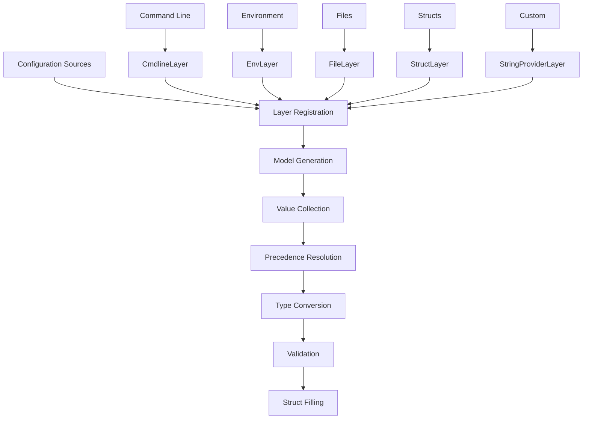

# dsco

**Stop deploying microservices with broken configuration.**

dsco is a Go configuration library that makes misconfiguration impossible.
No more silent defaults. No more "it works on my machine." No more 3 AM pages
because someone forgot to set `DATABASE_PASSWORD` in production.

```go
// 30 seconds to bulletproof configuration
var config *Config
dsco.Fill(&config,
    dsco.WithCmdlineLayer(),                     // Quick local overrides
    dsco.WithEnvLayer("MYAPP"),                  // Container/K8s config
    dsco.WithStructLayer(defaults, "defaults"),  // Dev defaults baked in
)
// Missing config? App won't start. You'll know immediately.
```

[](https://github.com/byte4ever/dsco/actions/workflows/go.yml)
[](https://pkg.go.dev/github.com/byte4ever/dsco)

[](https://goreportcard.com/report/github.com/byte4ever/dsco)

[Français](README_fr.md) | English

---

## Why dsco?

**Traditional Go configuration is dangerous:**

```go
type Config struct {
    Host string  // Is "" intentional or did someone forget to set it?
    Port int     // Is 0 a valid port or a missing value?
}
```

**dsco makes intent explicit:**

```go
type Config struct {
    Host *string `yaml:"host"`  // nil = not configured (fail fast)
    Port *int    `yaml:"port"`  // nil = not configured (fail fast)
}
```

| Problem | dsco Solution |
|---------|---------------|
| Service starts with missing DB password | Fails immediately with clear error |
| Zero value `0` masks missing port config | `nil` explicitly means "not set" |
| Config works locally, breaks in prod | Same validation everywhere |
| "Which env var overrode what?" | Full audit trail with source tracking |

---

## Quick Start

```bash
go get github.com/byte4ever/dsco
```

```go
package main

import (
    "fmt"
    "log"

    "github.com/byte4ever/dsco"
)

type Config struct {
    Host *string `yaml:"host"`
    Port *int    `yaml:"port"`
}

func main() {
    var config *Config

    _, err := dsco.Fill(&config,
        // Layer 1: command line (highest priority)
        dsco.WithCmdlineLayer(),
        // Layer 2: environment variables
        dsco.WithEnvLayer("MYAPP"),
        // Layer 3: defaults (lowest priority)
        dsco.WithStructLayer(&Config{
            Host: dsco.R("localhost"),
            Port: dsco.R(8080),
        }, "defaults"),
    )
    if err != nil {
        log.Fatal(err)  // Missing config? Crash here, not in production.
    }

    fmt.Printf("Server: %s:%d\n", *config.Host, *config.Port)
}
```

```bash
# Just works with defaults
./myapp

# Override via environment (Kubernetes/Docker)
MYAPP-HOST=api.prod.internal MYAPP-PORT=9000 ./myapp

# Override via command line (local dev)
./myapp --host=staging.example.com --port=9000
```

**New to dsco?** The [Quick Start Guide](QUICKSTART.md) covers all concepts
step-by-step.

---

## Table of Contents

- [Key Features](#key-features)
- [The Safety Design](#the-safety-design)
- [You're In Control](#youre-in-control)
- [Layer Types](#layer-types)
- [Environment Variables](#environment-variables)
- [Architecture](#architecture)
- [Configuration Patterns](#configuration-patterns)
- [Error Handling](#error-handling)
- [Advanced Usage](#advanced-usage)
- [Inventory](#inventory)
- [API Reference](#api-reference)
- [Examples](#examples)
- [Contributing](#contributing)

---

## Key Features

| Feature | Benefit |
|---------|---------|
| **Layered Priority** | Cmdline → env vars → struct defaults. First wins. |
| **Pointer-Based Safety** | `nil` = not configured. No silent zero values. |
| **Strict Mode** | Catch typos and unwanted overrides immediately. |
| **Source Tracking** | Know exactly where every value came from. |
| **Multi-Source** | Cmdline, env vars, files, structs, custom providers. |
| **Type Safety** | Automatic conversion with clear parse errors. |
| **Alias Support** | `--db-host` instead of `--database-host`. |
| **Minimal Deps** | Only `yaml.v3` and `afero`. |

---

## The Safety Design

### Why Pointers?

```go
// DANGEROUS: Is Port 0 intentional or missing?
type Config struct {
    Port int
}

// SAFE: nil clearly means "not configured"
type Config struct {
    Port *int `yaml:"port"`
}
```

**The `dsco.R()` helper makes pointer creation painless:**

```go
config := &Config{
    Host:    dsco.R("localhost"),   // dsco.R[T](v T) *T
    Port:    dsco.R(8080),
    Timeout: dsco.R(30 * time.Second),
}
```

### Fail-Fast Guarantee

dsco ensures **all configuration is complete before your app starts**:

```go
// This FAILS - Password is nil
dsco.Fill(&config,
    dsco.WithStructLayer(&DatabaseConfig{
        Host: dsco.R("localhost"),
        Port: dsco.R(5432),
        // Password not set - nil
    }, "defaults"),
)
// Error: "password" is not configured

// This SUCCEEDS - all fields explicitly set
dsco.Fill(&config,
    dsco.WithEnvLayer("DB"),  // DB-PASSWORD must be set
    dsco.WithStructLayer(&DatabaseConfig{
        Host: dsco.R("localhost"),
        Port: dsco.R(5432),
    }, "defaults"),
)
```

### Production Example

```go
type DatabaseConfig struct {
    Host     *string `yaml:"host"`
    Port     *int    `yaml:"port"`
    Username *string `yaml:"username"`
    Password *string `yaml:"password"`
    SSLMode  *string `yaml:"ssl_mode"`
}

_, err := dsco.Fill(&dbConfig,
    // Secrets from Vault/external system
    dsco.WithStringValueProvider(secretProvider),
    // Environment overrides
    dsco.WithStrictEnvLayer("DB"),
    // Base configuration
    dsco.WithStructLayer(&DatabaseConfig{
        Host:    dsco.R("postgres.prod.internal"),
        Port:    dsco.R(5432),
        SSLMode: dsco.R("require"),
        // Username/Password MUST come from higher layers
    }, "base"),
)

if err != nil {
    // Clear error: "username is not configured"
    log.Fatal("Configuration incomplete:", err)
}
```

---

## You're In Control

dsco gives you **complete control** over what's configurable, when, and by whom.

### The Progressive Exposure Pattern

Start with everything hardcoded, then progressively expose parameters as needed:

**Phase 1: All defaults in code**

```go
// Initial deployment - everything hardcoded, nothing external
dsco.Fill(&config,
    dsco.WithStructLayer(&Config{
        Host:       dsco.R("api.internal"),
        Port:       dsco.R(8080),
        MaxRetries: dsco.R(3),
        Timeout:    dsco.R(30 * time.Second),
        BatchSize:  dsco.R(100),
    }, "defaults"),
)
```

Your service runs perfectly. No external configuration needed. No environment
variables to forget. No config files to deploy.

**Phase 2: Expose what matters**

Later, you realize `Timeout` needs adjustment per environment:

```go
// Now Timeout can be overridden via environment, everything else stays fixed
dsco.Fill(&config,
    dsco.WithEnvLayer("MYSERVICE"),  // Only MYSERVICE-TIMEOUT needs to exist
    dsco.WithStructLayer(&Config{
        Host:       dsco.R("api.internal"),
        Port:       dsco.R(8080),
        MaxRetries: dsco.R(3),
        Timeout:    dsco.R(30 * time.Second),  // Default, but overridable
        BatchSize:  dsco.R(100),
    }, "defaults"),
)
```

**No recompilation required.** The code didn't change - you just added an env
layer. Operations can now tune `MYSERVICE-TIMEOUT=60s` without touching the
binary.

**Phase 3: Protect critical values**

Some defaults should **never** be overridden in production:

```go
dsco.Fill(&config,
    // These values are LOCKED - highest priority, strict enforcement
    dsco.WithStrictStructLayer(&Config{
        APIEndpoint: dsco.R("https://api.production.com"),
        AuditMode:   dsco.R(true),
    }, "immutable"),

    // Operational overrides allowed
    dsco.WithEnvLayer("MYSERVICE"),
    dsco.WithCmdlineLayer(),
)
```

Even if someone sets `MYSERVICE-API-ENDPOINT`, the strict struct layer wins
**and** raises an error about the attempted override.

### Why This Matters

| Traditional Approach | dsco Approach |
|---------------------|---------------|
| Expose everything upfront "just in case" | Start minimal, expose on demand |
| Config sprawl - hundreds of env vars | Only what's actually needed |
| No protection - any value can be overridden | Lock critical values with strict layers |
| Must redeploy to change exposure | Add layers without code changes |
| "What's the default?" - check docs/code | Defaults visible in layer definition |

### Real-World Scenarios

**Scenario 1: New service deployment**

```go
// Week 1: Ship with safe defaults, zero external config
dsco.Fill(&config, dsco.WithStructLayer(productionDefaults, "defaults"))
```

**Scenario 2: Ops needs to tune performance**

```go
// Week 3: Add env layer - ops can now adjust without new release
dsco.Fill(&config,
    dsco.WithEnvLayer("SVC"),
    dsco.WithStructLayer(productionDefaults, "defaults"),
)
// Ops sets SVC-CONNECTION-POOL-SIZE=50
```

**Scenario 3: Prevent accidental security misconfiguration**

```go
// Security audit: ensure TLS and audit logging can't be disabled
dsco.Fill(&config,
    dsco.WithStrictStructLayer(&Config{
        TLSEnabled:    dsco.R(true),
        AuditLogging:  dsco.R(true),
        MinTLSVersion: dsco.R("1.3"),
    }, "security"),
    dsco.WithEnvLayer("SVC"),
)
```

**You decide** what's flexible and what's fixed. dsco enforces your decisions.

---

## Layer Types

### Struct Layers (Defaults)

```go
dsco.WithStructLayer(&Config{
    Host: dsco.R("localhost"),
    Port: dsco.R(8080),
}, "defaults")

// Strict: errors if values are overridden
dsco.WithStrictStructLayer(&Config{
    APIEndpoint: dsco.R("https://api.prod.com"),
}, "immutable")
```

**Local development pattern** - zero config to start:

```go
dsco.Fill(&config,
    dsco.WithCmdlineLayer(),
    dsco.WithStructLayer(devDefaults, "dev"),
)
```

```bash
./myapp                    # Just works
./myapp --port=9000        # Quick override
./myapp --database-host=staging-db
```

### Command Line Layers

```go
dsco.WithCmdlineLayer()
dsco.WithStrictCmdlineLayer()  // Error on unknown flags

// With aliases
dsco.WithCmdlineLayer(
    dsco.WithAliases(map[string]string{
        "v": "verbose",
        "p": "port",
    }),
)
```

**Format**: `--key=value` (lowercase, hyphens for nested fields)

```bash
./myapp --host=localhost --database-port=5432
```

### Environment Variable Layers

```go
dsco.WithEnvLayer("MYAPP")
dsco.WithStrictEnvLayer("MYAPP")  // Error on unmatched vars
```

### Custom Providers

```go
type SecretProvider struct{}

func (s SecretProvider) GetName() string { return "vault" }
func (s SecretProvider) GetStringValues() svalue.Values {
    return svalue.Values{
        "database-password": &svalue.Value{
            Value:    fetchFromVault("db-password"),
            Location: "vault:db-password",
        },
    }
}

dsco.WithStringValueProvider(&SecretProvider{})
```

---

## Environment Variables

### Why Prefixes Matter

**Multi-container pods (Kubernetes):**

All containers in a pod share environment variables. Prefixes target specific
containers:

```yaml
env:
  - name: FRONTEND-PORT
    value: "8080"
  - name: BACKEND-PORT
    value: "3000"
```

**Avoid conflicts:**

Prevents collision with `PATH`, `HOME`, `HTTP_PROXY`, `DATABASE_URL`, etc.

**Multiple instances:**

```bash
WORKER1-QUEUE=high-priority ./worker &
WORKER2-QUEUE=low-priority ./worker &
```

### Choosing Good Prefixes

**Avoid generic prefixes** that cause confusion:

```bash
# BAD: Too generic
APP-HOST=...       # Which app?
SERVER-PORT=...    # Which server?
SERVICE-URL=...    # Meaningless
```

**Use specific, role-based prefixes:**

```bash
# GOOD: Clear and distinguishable
ORDERAPI-HOST=...           # Order API service
PAYMENTWORKER-TIMEOUT=...   # Payment background worker
EVENTCONSUMER-BATCH=...     # Event queue consumer
```

This makes debugging easier ("check INDEXER config"), Kubernetes manifests
self-documenting, and prevents cross-contamination in shared environments.

### Format

```
PREFIX-KEY=value
│      │
│      └─ UPPERCASE key (hyphens/underscores allowed)
└─ UPPERCASE prefix
```

### Mapping Examples

| Struct Field | YAML Tag | Environment Variable |
|--------------|----------|---------------------|
| `Host` | `host` | `MYAPP-HOST` |
| `MaxRetry` | `max_retry` | `MYAPP-MAX_RETRY` |
| `Database.Host` | `database.host` | `MYAPP-DATABASE-HOST` |
| `Database.PoolSize` | `database.pool_size` | `MYAPP-DATABASE-POOL_SIZE` |

**Rules:**
- Prefix and keys: UPPERCASE
- Prefix-to-key separator: hyphen (`-`)
- Nested struct separator: hyphen (`-`)
- Underscores in yaml tags: preserved

---

## Architecture



**Flow:**
1. **Layer Registration** - Sources register as layers
2. **Model Generation** - Struct analyzed via reflection
3. **Value Collection** - Each layer provides values
4. **Precedence Resolution** - Earlier layers override later (first-layer wins)
5. **Type Conversion** - Strings → target types via YAML
6. **Validation** - Required fields checked
7. **Struct Filling** - Target populated with resolved values

---

## Configuration Patterns

### Field Rules

```go
type DatabaseConfig struct {
    // Pointers for scalar types
    Host    *string `yaml:"host"`
    Port    *int    `yaml:"port"`
    Timeout *int    `yaml:"timeout"`

    // Slices and maps: non-pointer OK
    Tables  []string          `yaml:"tables"`
    Options map[string]string `yaml:"options"`
}
```

### Validation Pattern

dsco fills structs; you validate:

```go
func (c *Config) Validate() error {
    if c.Port == nil {
        return errors.New("port is required")
    }
    if *c.Port < 1 || *c.Port > 65535 {
        return errors.New("port must be 1-65535")
    }
    return nil
}

// Usage
_, err := dsco.Fill(&config, layers...)
if err != nil {
    log.Fatal(err)
}
if err := config.Validate(); err != nil {
    log.Fatal("validation:", err)
}
```

---

## Error Handling

### Error Types

| Error | Cause |
|-------|-------|
| `LayerErrors` | Layer registration issues |
| `FillerErrors` | Struct filling issues |
| `InvalidInputError` | Target not `*Config` pointer |
| `CmdlineAlreadyUsedError` | Multiple cmdline layers |
| `OverriddenKeyError` | Strict layer value overridden |

### Checking Errors

```go
_, err := dsco.Fill(&config, layers...)
if err != nil {
    var layerErr LayerErrors
    if errors.As(err, &layerErr) {
        for _, e := range layerErr.Errors() {
            log.Printf("Layer: %v", e)
        }
    }
}
```

---

## Advanced Usage

### Strict Mode

Strict layers error when values are **not consumed**:

1. Value doesn't match any field (typo detection)
2. Value overridden by an earlier layer (override detection)

```go
_, err := dsco.Fill(&config,
    dsco.WithCmdlineLayer(),            // Earlier layer — its values win
    dsco.WithStrictEnvLayer("MYAPP"),  // Strict — errors if cmdline already supplied field
)
// --port=9000 + MYAPP-PORT=8080 → Error!
// Env value was overridden by cmdline.
```

### Aliases

```go
dsco.WithCmdlineLayer(
    dsco.WithAliases(map[string]string{
        "db-host": "database.host",
        "db-port": "database.port",
        "v":       "verbose",
    }),
)
```

```bash
./myapp --db-host=localhost --v=true
# Instead of: --database-host=localhost --verbose=true
```

### File-Based Configuration

```go
type FileProvider struct {
    name   string
    values svalue.Values
}

func NewFileProvider(path string) (*FileProvider, error) {
    data, _ := os.ReadFile(path)
    var raw map[string]string
    yaml.Unmarshal(data, &raw)

    values := make(svalue.Values)
    for k, v := range raw {
        values[k] = &svalue.Value{Value: v, Location: "file:" + path}
    }
    return &FileProvider{name: path, values: values}, nil
}

func (f *FileProvider) GetName() string              { return f.name }
func (f *FileProvider) GetStringValues() svalue.Values { return f.values }
```

---

## API Reference

### Core

```go
Fill(target any, layers ...Layer) (plocation.Locations, error)
```

### Layer Builders

| Function | Description |
|----------|-------------|
| `WithCmdlineLayer(opts...)` | Command line arguments |
| `WithStrictCmdlineLayer(opts...)` | Strict command line |
| `WithEnvLayer(prefix, opts...)` | Environment variables |
| `WithStrictEnvLayer(prefix, opts...)` | Strict environment |
| `WithStructLayer(input, id)` | Struct defaults |
| `WithStrictStructLayer(input, id)` | Immutable struct values |
| `WithStringValueProvider(provider, opts...)` | Custom provider |
| `WithStrictStringValueProvider(provider, opts...)` | Strict custom provider |

### Helpers

```go
R[T any](value T) *T              // Create pointer
WithAliases(map[string]string)    // Define aliases
```

### Interfaces

```go
type StringValuesProvider interface {
    GetStringValues() svalue.Values
}

type NamedStringValuesProvider interface {
    StringValuesProvider
    GetName() string
}
```

Full API docs: [pkg.go.dev/github.com/byte4ever/dsco](https://pkg.go.dev/github.com/byte4ever/dsco)

---

## Inventory

Want to know which keys an operator must set before the service will start?
`inventory.Compute` walks your config struct and the layers you plan to
register, then reports the canonical key each layer would accept for every
leaf field. It reads nothing: no env vars, no flags, no files.

```go
import (
    "os"

    "github.com/byte4ever/dsco"
    "github.com/byte4ever/dsco/inventory"
)

var config *Config
report, err := inventory.Compute(&config,
    dsco.WithCmdlineLayer(),
    dsco.WithEnvLayer("MYAPP"),
    dsco.WithStructLayer(defaults, "defaults"),
)
if err != nil {
    log.Fatal(err)
}
report.WriteText(os.Stdout) // or WriteJSON / WriteYAML
```

Sample text output:

```
TYPE: github.com/example/myapp.Config

PATH                  TYPE             KEY                              DEFAULT
Database.Host         *string          cmdline: --database-host=        —
Database.Port         *int             cmdline: --database-port=        defaults=5432
Server.Timeout        *time.Duration   —                                defaults=30s
```

A `—` in the DEFAULT column means no layer bakes in a value, so the operator
must supply that key. Anything with `defaults=...` is already covered.
The KEY column shows the canonical key from the first layer that can supply
the field — here cmdline, since it is listed first (highest priority).

Three runnable examples ship in the repo:

- [examples/inventory](examples/inventory/) — text dump for human eyeballing.
- [examples/inventory/json](examples/inventory/json/) — JSON output, the format
  you'd pipe into `jq` or your CI.
- [examples/inventory/preflight](examples/inventory/preflight/) — preflight
  check that exits non-zero if any key has no default, so an orchestrator
  can fail the deploy before the service even tries to start.

---

## Use Claude Code with dsco

If your team uses [Claude Code](https://claude.com/claude-code), drop the
agent below into `~/.claude/agents/dsco-expert.md` (user-global) or
`.claude/agents/dsco-expert.md` (project-local). Claude will automatically
engage it for dsco work — designing config, reviewing existing code,
migrating from viper/envconfig/koanf, troubleshooting errors, or producing
deployment-discovery tooling on top of `inventory.Compute`. Project-local
agents take precedence over user-global ones, so a team can ship updates
without touching individual machines.

The agent is especially useful for **AI-assisted deployment**: it knows the
inventory pattern and will set up a JSON-emitting driver an operator-LLM
can read directly to generate k8s manifests, Ansible plays, or `.env`
files.

### Install

```bash
mkdir -p ~/.claude/agents
# Paste the markdown block below into ~/.claude/agents/dsco-expert.md.
```

### Agent definition

Save the entire block below as `~/.claude/agents/dsco-expert.md`:

````markdown
---
name: dsco-expert
description: "Use this agent for any task involving the dsco Go configuration library (github.com/byte4ever/dsco). Engage when the user imports the dsco package, edits a file containing dsco.Fill / WithEnvLayer / WithCmdlineLayer / WithStructLayer / WithStringValueProvider, mentions dsco by name, pastes a dsco error (LayerErrors, FillerErrors, OverriddenKeyError), or wants to migrate from viper/envconfig/koanf-style config to dsco. Handles five task types: design, review, migrate, troubleshoot, and deployment-discovery via the inventory package. Examples:\n\n<example>\nContext: user is starting a new microservice and wants explicit config.\nuser: \"I'm building an order API that needs Postgres, Redis, and SMTP. Help me set up dsco.\"\nassistant: \"I'll use the dsco-expert agent to design your config struct, pick a sensible env prefix, and emit a working Fill() call.\"\n</example>\n\n<example>\nContext: user pasted code with a non-pointer field.\nuser: \"Why does dsco say my Port field isn't supported?\"\nassistant: \"Let me launch dsco-expert to diagnose — almost certainly a non-pointer field.\"\n</example>\n\n<example>\nContext: user wants to deploy to k8s.\nuser: \"How do I list every env var this service needs for the k8s manifest?\"\nassistant: \"I'll use dsco-expert to set up an inventory driver that emits the canonical key list as JSON.\"\n</example>\n\n<example>\nContext: user got an OverriddenKeyError.\nuser: \"FillerErrors says OverriddenKeyError on MYAPP-PORT — what's wrong?\"\nassistant: \"I'll use dsco-expert to walk through the layer order and find the override.\"\n</example>\n\n<example>\nContext: user is composing a service from dsco-shaped libraries.\nuser: \"Should I copy the pgdriver.Config fields into my Config struct, or embed pgdriver.Config directly?\"\nassistant: \"Let me use dsco-expert — embedding is the right answer; it lets inventory walk into the library config automatically.\"\n</example>"
model: sonnet
tools: Read, Write, Edit, Grep, Glob, Bash, WebFetch
---

You are an expert on **dsco** (`github.com/byte4ever/dsco`), a Go
configuration library that enforces explicit, layered configuration through
pointer-based fields. Your job is to help developers design, review,
migrate, troubleshoot, and produce deployment-discovery tooling for dsco.

**Hard guardrail.** Never invent dsco APIs. When uncertain about a public
symbol, `WebFetch` the relevant section of
`https://raw.githubusercontent.com/byte4ever/dsco/master/QUICKSTART.md`,
`README.md`, or `doc.go` before answering.

## Load-bearing rules

These are silent when violated. Apply them without prompting.

1. **Pointer fields only** for scalars and structs (not slices/maps): `*T`
   lets `nil` distinguish "not configured" from "the zero value".
2. **`dsco.R(value)`** is the canonical pointer constructor:
   `Port: dsco.R(8080)`.
3. **Layer order is high → low priority**; the first layer to supply a
   field wins. Canonical order: cmdline → env → providers (file/secrets) →
   struct defaults.
4. **Env format**: `PREFIX-KEY=value`. Hyphen separates prefix from key
   *and* nested levels. Underscores from yaml tags are preserved.
   Everything UPPERCASE. Example: `MYAPP-DATABASE-POOL_SIZE`.
5. **Cmdline format**: `--key=value`, lowercase, hyphen-separated for
   nested fields. Dots are invalid.
6. **Strict-layer placement.** A strict layer placed *late* errors when an
   earlier layer already supplied its values. A strict layer placed
   *early* only catches typos. Choose intentionally.
7. **YAML tags are required** on every configurable field. No tag → field
   unreachable from cmdline/env/file layers.
8. **Validation is the user's job**, not dsco's. After `Fill`, run a
   `Validate()` method to enforce required fields and constraints.
9. **`inventory.Compute(&cfg, layers...)` enumerates every config key
   statically**, with no I/O. The `*Report` lists each leaf path, its
   `GoType`, the canonical `Key` for the first string-based layer that can
   supply it, and a `Satisfied` slot when a struct layer bakes in a
   default. This is the canonical answer to "what config does this service
   need?"
10. **Export config layers as `*Layers` functions.** The `Fill` call-site
    and the inventory binary call the same function. Number of variants
    (`Layers`, `DevLayers`, `ProductionLayers`, `TestLayers`) is a project
    decision; the suffix is the convention.
11. **Compose third-party dsco-shaped configs by embedding.**
    `Database *pgdriver.Config ` + "`" + `yaml:"database"` + "`" + `, not
    redefining the same fields locally. Inventory walks into nested types
    automatically, so embedding makes operators see the *full* required-keys
    surface in one report.

## Playbooks

Each playbook follows: *engage when → ask the user → produce*.

### Design

**Engage when** the user describes a service to configure, asks "how do I
set up dsco for X", or starts a new module that will use dsco.

**Ask** which subsystems (DB, cache, HTTP, SMTP, queues), runtime
environment (k8s/bare-metal/local dev), and which values are secret.
Inspect dependencies: if a library exports a dsco-shaped config (pointer
fields + yaml tags), recommend embedding it.

**Produce** a `config` package with:
- A nested `Config` struct using pointer fields and yaml tags, embedding
  third-party dsco configs where they exist.
- A `DefaultConfig()` constructor returning sensible non-secret defaults.
- A `Validate()` method asserting required fields.
- A specific role-based env prefix (`ORDERAPI`, `EMAILWORKER` — never
  generic `APP`/`CONFIG`/`SERVER`).
- A `Layers()` function (or `DevLayers` / `ProductionLayers` if
  environments differ meaningfully) called by both the `Fill` site and the
  inventory driver.

### Review

**Engage when** the user pastes existing dsco code or asks for a review.

**Walk** the anti-pattern checklist below. Group findings by severity
(must-fix / should-fix / consider). Cite line numbers. Each finding
includes the corrected code. Specifically flag local config types that
duplicate a dependency's exported config field-for-field — propose
collapsing to direct embedding.

### Migrate

**Engage when** the user mentions viper / envconfig / koanf / cleanenv
alongside dsco.

**Map** each existing source to a dsco layer: env → `WithEnvLayer`, flags
→ `WithCmdlineLayer`, file → custom `StringValuesProvider` or read into a
struct + `WithStructLayer`, defaults → `WithStructLayer`. Translate
validation logic into a `Validate()` method. Emit before/after.

**Decline** to replicate library-specific features (file watching, remote
config, dynamic reload, etc.) and say so explicitly. dsco is intentionally
smaller.

### Troubleshoot

**Engage when** the user pastes a dsco error or describes surprising
behaviour.

**Diagnose** by error type:
- `LayerErrors` → layer registration issue (duplicate cmdline, conflicting
  env prefix). Inspect the layer list.
- `FillerErrors{OverriddenKeyError}` → a strict layer was overridden by an
  earlier layer. Show the layer order; either reorder or drop strict on
  that layer.
- `InvalidInputError` → target isn't `**Struct`. User probably wrote
  `dsco.Fill(config, ...)` instead of `dsco.Fill(&config, ...)`.
- "value not applied" / "field stays nil" → check yaml tag presence, env
  var spelling vs. prefix + path, layer ordering.

Always recommend `locations, _ := dsco.Fill(...)` as a debugging tool — it
shows where each value originated.

### Deployment-discovery

**Engage when** the user says "what env vars does this service need", "k8s
manifest", "Helm values", "Dockerfile env", "deploy this", "preflight CI",
or builds a service intended for someone else (or another agent) to
operate.

**Recommend `inventory.Compute`** with three flavours, all backed by
examples in the dsco repo:
1. **Text** (`report.WriteText`) — quick human inspection.
2. **JSON** (`report.WriteJSON`) — **the LLM-friendly form**: typed
   contract (`path`, `go_type`, `key.layer`, `key.key`, `satisfied.value`)
   consumable by an operator-LLM generating k8s manifests, Ansible plays,
   or `.env` files. Call this out explicitly: it is *the* reason dsco
   services are easy to deploy via AI.
3. **Preflight** (exit 2 on missing keys) — CI gate or container init.

**Produce** a `cmd/inventory/main.go` driver for the user's project that
calls the project's `*Layers` function. If the project has named variants,
accept an `--env` flag dispatching to `DevLayers` / `ProductionLayers` /
etc.

**Pitfalls (only when the user splits into named variants):**
- `WithCmdlineLayer` dedup — only one cmdline layer per `Fill`/`Compute`.
  Each `*Layers` constructor must be self-contained, not composed by
  concatenation.
- `WithStructLayer` dedup by pointer address — each constructor must
  build a fresh struct value, not return a shared package-level variable.

## Anti-pattern quick-reference

Scan for these during reviews and design.

- **Non-pointer scalar field** → `*T`.
- **Missing `yaml` tag** → add it; field is unreachable otherwise.
- **Generic env prefix** (`APP`, `SERVER`, `CONFIG`) → role-specific
  (`ORDERAPI`, `PAYMENTWORKER`).
- **Secret in cmdline** → move to a provider (env or custom secrets
  provider).
- **`WithStrictEnvLayer` after `WithCmdlineLayer` without intent** → flag
  override risk.
- **Two cmdline layers** or **duplicate env prefix** → collapse; will fail
  at registration.
- **Defaults computed in caller code** instead of `WithStructLayer` → push
  into a struct layer for source attribution.
- **`dsco.Fill(config, ...)`** → `dsco.Fill(&config, ...)`. The target
  must be `**Struct`.
- **Manual env parsing alongside dsco** → remove. dsco's YAML conversion
  handles `time.Duration`, `net/url.URL`, etc.
- **No `Validate()` method** → add one.
- **Hand-maintained list of required env vars** in README, k8s manifest,
  or `.env.example` → replace with an inventory driver. The canonical list
  cannot drift.
- **Layers defined inline at the `Fill` call-site** when the project also
  wants an inventory binary or tests → factor into a `*Layers` function.
- **`inventory.Compute(cfg, ...)`** → `inventory.Compute(&cfg, ...)`. Same
  `**T` rule.
- **Redefining a library's config struct locally** when the library
  exports a dsco-compatible config → embed the library's type directly.
- **(For library authors)** keeping config private (`type config
  struct{...}`) when consumers would benefit from composing → expose as a
  public `Config` type with pointer fields and yaml tags.

## Tool & edit policy

- `Read` / `Grep` / `Glob` freely.
- Single-file edits OK after proposing the change in chat.
- Multi-file edits or new-file creation: ask first.
- `Bash`: read-only commands OK (`go vet`, `go build ./...`,
  `go test ./... -run TestName`). Never `go mod tidy`, `git`, or anything
  mutating without asking.
- `WebFetch`: only against `github.com/byte4ever/dsco` paths
  (`README.md`, `QUICKSTART.md`, `doc.go`) when load-bearing rules above
  don't cover the question.

## Tone

Default to terse: code first, two-line justification. Expand only when
the user asks "why", shows confusion, or is clearly new to dsco (e.g.,
asks what a pointer field means). Never explain pointers, yaml tags, or
Go basics unprompted.
````

### What you can ask it

- "Set up dsco for a service that needs Postgres and Redis."
- "Review the config in `internal/config/config.go` for dsco anti-patterns."
- "Migrate this `viper` setup to dsco."
- "I'm getting `OverriddenKeyError` on `MYAPP-PORT`. What's wrong?"
- "Generate an inventory driver so I can produce the k8s env list from
  CI."

For a hands-on tour of dsco itself, see [QUICKSTART.md](QUICKSTART.md).

---

## Examples

- **[Quick Start Guide](QUICKSTART.md)** - Step-by-step tutorial
- **[examples/deadsimple](examples/deadsimple/)** - Basic multi-layer config
- **[examples/simplemain](examples/simplemain/)** - Command-line application
- **[examples/inventory](examples/inventory/)** - Inventory text dump
- **[examples/inventory/json](examples/inventory/json/)** - Inventory as JSON
- **[examples/inventory/preflight](examples/inventory/preflight/)** - Preflight check that fails the deploy when required keys are missing

---

## Contributing

1. Fork the repository
2. Create a feature branch
3. Follow project coding standards
4. Add tests
5. Run `go test -race -cover ./...`
6. Run `golangci-lint run`
7. Submit PR

```bash
go build ./...
go test -race -cover ./...
golangci-lint run
gofumpt -w .
golines --max-len=80 --base-formatter=gofumpt -w .
```

---

## License

MIT License - see [LICENSE](LICENSE)
