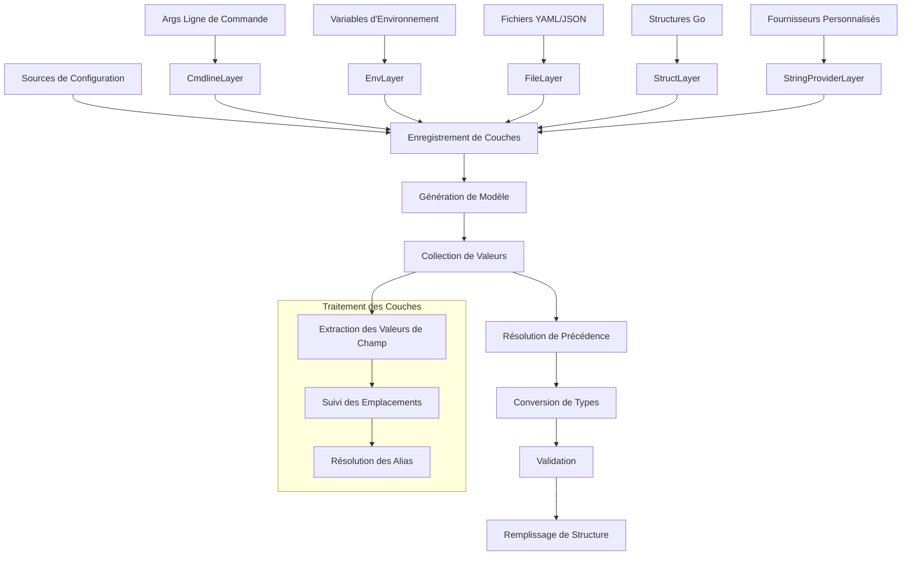

# dsco (se prononce /ˈdɪskoʊ/. Oui ! comme la musique des années 70)

[](https://github.com/byte4ever/dsco/actions/workflows/go.yml)
[](https://pkg.go.dev/github.com/byte4ever/dsco)

[](https://goreportcard.com/report/github.com/byte4ever/dsco)

[](https://codeclimate.com/github/byte4ever/dsco/maintainability)
[](https://codeclimate.com/github/byte4ever/dsco/test_coverage)
[](https://codecov.io/gh/byte4ever/dsco)

[](https://github.com/byte4ever/dsco/)

Français | [English](README.md)

Une bibliothèque de configuration Go puissante qui fournit un système de 
configuration en couches prenant en charge les arguments de ligne de commande, 
les variables d'environnement, les fichiers YAML et les configurations basées 
sur des structures avec validation stricte.

## Table des matières

- [Présentation](#présentation)
- [Fonctionnalités clés](#fonctionnalités-clés)
- [Installation](#installation)
- [Démarrage rapide](#démarrage-rapide)
- [Aperçu de l'architecture](#aperçu-de-larchitecture)
- [Types de couches](#types-de-couches)
- [Modèles de structures de configuration](#modèles-de-structures-de-configuration)
- [Gestion des erreurs](#gestion-des-erreurs)
- [Utilisation avancée](#utilisation-avancée)
- [Référence API](#référence-api)
- [Contribuer](#contribuer)
- [Licence](#licence)

## Présentation

dsco implémente un système de configuration en couches où différentes sources 
de configuration (ligne de commande, variables d'environnement, fichiers, 
structures) sont organisées en couches avec une précédence configurable. 
Les couches ultérieures remplacent les précédentes, avec un mode strict 
optionnel pour la détection des conflits.

## Fonctionnalités clés

- **Configuration multi-sources** : Arguments de ligne de commande, variables 
  d'environnement, fichiers YAML/JSON, structures Go et fournisseurs personnalisés
- **Système de priorité en couches** : Précédence configurable avec contrôle 
  de remplacement
- **Mode strict** : Détection des valeurs de configuration inutilisées et 
  des conflits
- **Sécurité des types** : Conversion automatique des types avec validation
- **Basé sur la réflexion** : Fonctionne avec toute structure Go utilisant 
  des étiquettes
- **Support des alias** : Définir des raccourcis pour des chemins de champ 
  complexes
- **Agrégation d'erreurs** : Rapport d'erreur complet avec suivi des 
  emplacements
- **Zéro dépendances** : Go pur avec des exigences externes minimales

## Installation

```bash
go get github.com/byte4ever/dsco
```

Nécessite Go 1.21 ou plus récent.

## Démarrage rapide

### Exemple de base

```go
package main

import (
    "fmt"
    "log"
    "time"

    "github.com/byte4ever/dsco"
)

// Structure de configuration avec des champs pointeurs
type Config struct {
    Host     *string        `yaml:"host"`
    Port     *int           `yaml:"port"`
    Timeout  *time.Duration `yaml:"timeout"`
    Verbose  *bool          `yaml:"verbose"`
}

func main() {
    var config *Config

    // Remplir la configuration à partir de plusieurs sources
    _, err := dsco.Fill(
        &config,
        dsco.WithCmdlineLayer(),
        dsco.WithEnvLayer("MYAPP"),
        dsco.WithStructLayer(&Config{
            Host:    dsco.R("localhost"),
            Port:    dsco.R(8080),
            Timeout: dsco.R(30 * time.Second),
            Verbose: dsco.R(false),
        }, "defaults"),
    )

    if err != nil {
        log.Fatal(err)
    }

    fmt.Printf("Serveur: %s:%d\n", *config.Host, *config.Port)
    fmt.Printf("Timeout: %v\n", *config.Timeout)
    fmt.Printf("Verbose: %t\n", *config.Verbose)
}
```

### Exemples d'utilisation

```bash
# Arguments de ligne de commande
./myapp --host=production.com --port=9000

# Variables d'environnement
MYAPP_HOST=production.com MYAPP_PORT=9000 ./myapp

# Combiné (la ligne de commande a la précédence)
MYAPP_HOST=staging.com ./myapp --host=production.com
```

## Aperçu de l'architecture

La bibliothèque dsco implémente un système de configuration en couches 
sophistiqué :



### Flux de configuration

1. **Enregistrement des couches** : Les différentes sources de configuration 
   s'enregistrent comme couches
2. **Génération du modèle** : La structure cible est analysée via la réflexion
3. **Collection de valeurs** : Chaque couche fournit des valeurs de champ 
   depuis sa source
4. **Résolution de précédence** : Les couches ultérieures remplacent les 
   précédentes
5. **Conversion de types** : Les valeurs de chaîne sont converties vers les 
   types cibles via YAML
6. **Validation** : Les champs requis et la validation personnalisée sont 
   appliqués
7. **Remplissage de structure** : La structure cible est peuplée avec les 
   valeurs résolues

## Types de couches

### Couches de ligne de commande

```go
// Mode normal - les drapeaux non utilisés sont ignorés
dsco.WithCmdlineLayer()

// Mode strict - tous les drapeaux doivent être utilisés
dsco.WithStrictCmdlineLayer()

// Avec des alias
dsco.WithCmdlineLayer(
    dsco.WithAliases(map[string]string{
        "v": "verbose",
        "p": "port",
    }),
)
```

### Couches de variables d'environnement

```go
// Mode normal avec préfixe
dsco.WithEnvLayer("MYAPP")

// Mode strict - toutes les variables d'env correspondantes doivent être utilisées
dsco.WithStrictEnvLayer("MYAPP")

// Plusieurs préfixes autorisés
dsco.WithEnvLayer("MYAPP"),
dsco.WithEnvLayer("GLOBAL"),
```

**Mappage des variables d'environnement** :
- Champ `Authentication.AccessToken` → `MYAPP_AUTHENTICATION_ACCESS_TOKEN`
- Les structures imbriquées utilisent la séparation par underscore
- Indices de tableau : `Items[0].Name` → `MYAPP_ITEMS_0_NAME`

### Couches de structures

```go
// Valeurs par défaut (peuvent être remplacées)
dsco.WithStructLayer(&Config{
    Host: dsco.R("localhost"),
    Port: dsco.R(8080),
}, "defaults")

// Valeurs immuables (mode strict)
dsco.WithStrictStructLayer(&Config{
    Host: dsco.R("production.com"),
}, "immutable")
```

### Couches de fournisseurs de chaînes

```go
// Implémentation de fournisseur personnalisé
type SecretProvider struct{}

func (s SecretProvider) GetName() string {
    return "secrets"
}

func (s SecretProvider) GetStringValues() svalue.Values {
    return svalue.Values{
        "database.password": svalue.Value{
            Value:    getSecretFromVault("db-password"),
            Location: svalue.NewLocation("vault", "db-password"),
        },
    }
}

// Utilisation
dsco.WithStringValueProvider(&SecretProvider{})
```

## Modèles de structures de configuration

Basées sur les conventions du projet, les structures de configuration doivent 
suivre des modèles spécifiques :

### Règles de déclaration des champs

```go
type DatabaseConfig struct {
    // Tous les champs doivent être des pointeurs (sauf slices/maps)
    Host     *string `yaml:"host" json:"host,omitempty"`
    Port     *int    `yaml:"port" json:"port,omitempty"`

    // Les slices et maps peuvent être non-pointeurs
    Tables   []string          `yaml:"tables" json:"tables,omitempty"`
    Options  map[string]string `yaml:"options" json:"options,omitempty"`

    // Documentation extensive requise
    // Timeout spécifie la durée maximale de connexion en secondes.
    // Si nil, par défaut 30 secondes.
    // Exemple : 10
    Timeout *int `yaml:"timeout" json:"timeout,omitempty"`
}
```

### Modèle de fonction fournisseur

```go
func NewDatabasePool(config *DatabaseConfig) (*DatabasePool, error) {
    // 1. Valider la configuration
    if err := validateConfig(config); err != nil {
        return nil, fmt.Errorf("configuration invalide: %w", err)
    }

    // 2. Créer le composant
    pool := &DatabasePool{}

    // 3. Copier la config si fournie (intégrer, pas pointeur)
    if config != nil {
        pool.DatabaseConfig = *config
    }

    return pool, nil
}

func validateConfig(cfg *DatabaseConfig) error {
    if cfg == nil {
        return errors.New("la config est nil")
    }
    if cfg.Host == nil {
        return errors.New("l'hôte doit être défini")
    }
    if cfg.Port == nil || *cfg.Port < 1 || *cfg.Port > 65535 {
        return errors.New("le port doit être entre 1 et 65535")
    }
    return nil
}
```

## Gestion des erreurs

### Types d'erreurs

dsco fournit des types d'erreur complets avec information d'emplacement :

```go
// Erreurs d'enregistrement de couches
type LayerErrors struct {
    merror.MError
}

// Erreurs de valeurs de champ
type FillerErrors struct {
    merror.MError
}

// Types d'erreur spécifiques
type InvalidInputError struct {
    Type reflect.Type
}

type CmdlineAlreadyUsedError struct {
    Index int
}

type OverriddenKeyError struct {
    Path             string
    Location         svalue.Location
    OverrideLocation svalue.Location
}
```

### Vérification des erreurs

```go
_, err := dsco.Fill(&config, layers...)
if err != nil {
    var layerErr LayerErrors
    if errors.As(err, &layerErr) {
        for _, e := range layerErr.Errors() {
            fmt.Printf("Erreur de couche: %v\n", e)
        }
    }

    var fillerErr FillerErrors
    if errors.As(err, &fillerErr) {
        for _, e := range fillerErr.Errors() {
            fmt.Printf("Erreur de remplissage: %v\n", e)
        }
    }
}
```

## Utilisation avancée

### Exemple de mode strict

```go
// Tous les drapeaux de ligne de commande doivent être utilisés
_, err := dsco.Fill(
    &config,
    dsco.WithStrictCmdlineLayer(),
    dsco.WithStrictEnvLayer("MYAPP"),
)

// Erreur si des drapeaux/variables d'env non utilisés sont présents
if err != nil {
    var overriddenErr OverriddenKeyError
    if errors.As(err, &overriddenErr) {
        fmt.Printf("Valeur non utilisée à %s\n", overriddenErr.Path)
    }
}
```

### Configuration complexe avec alias

```go
type ComplexConfig struct {
    Database *DatabaseConfig `yaml:"database"`
    Server   *ServerConfig   `yaml:"server"`
    Logging  *LogConfig      `yaml:"logging"`
}

_, err := dsco.Fill(
    &config,
    dsco.WithCmdlineLayer(
        dsco.WithAliases(map[string]string{
            "db-host": "database.host",
            "db-port": "database.port",
            "port":    "server.port",
            "v":       "logging.verbose",
        }),
    ),
    dsco.WithEnvLayer("MYAPP"),
    dsco.WithStructLayer(defaults, "defaults"),
)
```

### Configuration basée sur fichiers

```go
// Utilisation du fournisseur kfile pour les fichiers YAML
fileProvider, err := kfile.NewEntriesProvider("config.yaml")
if err != nil {
    log.Fatal(err)
}

_, err = dsco.Fill(
    &config,
    dsco.WithStringValueProvider(fileProvider),
    dsco.WithCmdlineLayer(), // Remplacer les valeurs de fichier
)
```

### Validation personnalisée

```go
type ValidatedConfig struct {
    Port *int `yaml:"port" validate:"min=1,max=65535"`
    URL  *string `yaml:"url" validate:"required,url"`
}

func (c *ValidatedConfig) Validate() error {
    if c.Port != nil && (*c.Port < 1 || *c.Port > 65535) {
        return errors.New("le port doit être entre 1 et 65535")
    }
    if c.URL != nil && !isValidURL(*c.URL) {
        return errors.New("format d'URL invalide")
    }
    return nil
}
```

## Référence API

### Fonctions principales

- `Fill(target any, layers ...Layer) (plocation.Locations, error)`
  - Fonction principale pour remplir une structure de configuration depuis 
    les couches

### Constructeurs de couches

- `WithCmdlineLayer(options ...Option) *CmdlineLayer`
- `WithStrictCmdlineLayer(options ...Option) *StrictCmdlineLayer`
- `WithEnvLayer(prefix string, options ...Option) *EnvLayer`
- `WithStrictEnvLayer(prefix string, options ...Option) *StrictEnvLayer`
- `WithStructLayer(input any, id string) *StructLayer`
- `WithStrictStructLayer(input any, id string) *StrictStructLayer`
- `WithStringValueProvider(provider NamedStringValuesProvider, options ...Option) *StringProviderLayer`
- `WithStrictStringValueProvider(provider NamedStringValuesProvider, options ...Option) *StrictStringProviderLayer`

### Options

- `WithAliases(aliases map[string]string) Option`
  - Définir des alias de chemin de champ

### Fonctions utilitaires

- `R[T any](value T) *T`
  - Aide pour créer un pointeur vers une valeur

### Interfaces

```go
type Layer interface {
    register(to *layerBuilder) error
}

type StringValuesProvider interface {
    GetStringValues() svalue.Values
}

type NamedStringValuesProvider interface {
    StringValuesProvider
    GetName() string
}
```

Pour la documentation API complète, visitez [pkg.go.dev](https://pkg.go.dev/github.com/byte4ever/dsco).

## Exemples

Consultez le répertoire [examples](examples/) pour des exemples complets 
fonctionnels :

- [deadsimple](examples/deadsimple/) : Configuration multi-couches de base
- [simplemain](examples/simplemain/) : Exemple d'application en ligne de commande

## Contribuer

Les contributions sont les bienvenues ! Veuillez :

1. Forker le dépôt
2. Créer une branche de fonctionnalité
3. Faire vos changements en suivant les standards de codage du projet
4. Ajouter des tests pour les nouvelles fonctionnalités
5. Exécuter la suite de tests complète : `go test -race -cover ./...`
6. Exécuter le linting : `golangci-lint run`
7. Soumettre une pull request

### Commandes de développement

```bash
# Construire et tester
go build ./...
go test -race -cover ./...

# Linting et formatage
golangci-lint run
gofumpt -w .
golines --max-len=80 --base-formatter=gofumpt -w .
```

## Licence

Ce projet est sous licence MIT - voir le fichier [LICENSE](LICENSE) pour 
les détails.