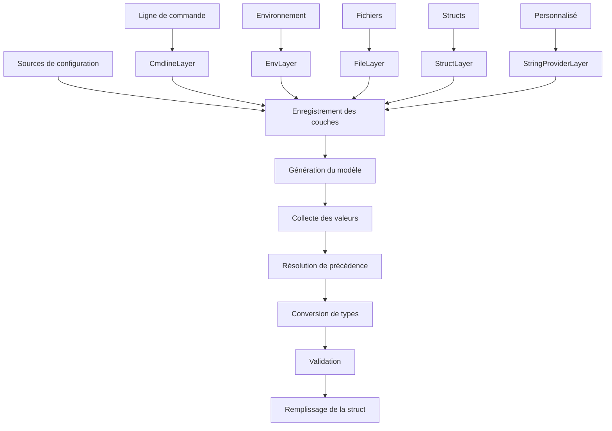

# dsco

**Arrêtez de déployer des microservices avec une configuration cassée.**

dsco est une bibliothèque de configuration Go qui rend les erreurs de
configuration impossibles. Plus de valeurs par défaut silencieuses. Plus de
"ça marche sur ma machine." Plus d'alertes à 3h du matin parce que quelqu'un
a oublié de définir `DATABASE_PASSWORD` en production.

```go
// 30 secondes pour une configuration blindée
var config *Config
dsco.Fill(&config,
    dsco.WithCmdlineLayer(),                     // Surcharges locales rapides
    dsco.WithEnvLayer("MYAPP"),                  // Config Container/K8s
    dsco.WithStructLayer(defaults, "defaults"),  // Valeurs par défaut dev intégrées
)
// Configuration manquante ? L'app ne démarre pas. Vous le saurez immédiatement.
```

[](https://github.com/byte4ever/dsco/actions/workflows/go.yml)
[](https://pkg.go.dev/github.com/byte4ever/dsco)

[](https://goreportcard.com/report/github.com/byte4ever/dsco)

Français | [English](README.md)

---

## Pourquoi dsco ?

**La configuration Go traditionnelle est dangereuse :**

```go
type Config struct {
    Host string  // Est-ce que "" est intentionnel ou quelqu'un a oublié de le définir ?
    Port int     // Est-ce que 0 est un port valide ou une valeur manquante ?
}
```

**dsco rend l'intention explicite :**

```go
type Config struct {
    Host *string `yaml:"host"`  // nil = non configuré (échec rapide)
    Port *int    `yaml:"port"`  // nil = non configuré (échec rapide)
}
```

| Problème | Solution dsco |
|----------|---------------|
| Le service démarre sans mot de passe DB | Échec immédiat avec erreur claire |
| La valeur zéro `0` masque un port manquant | `nil` signifie explicitement "non défini" |
| La config marche en local, casse en prod | Même validation partout |
| "Quelle variable d'env a surchargé quoi ?" | Traçabilité complète avec suivi des sources |

---

## Démarrage rapide

```bash
go get github.com/byte4ever/dsco
```

```go
package main

import (
    "fmt"
    "log"

    "github.com/byte4ever/dsco"
)

type Config struct {
    Host *string `yaml:"host"`
    Port *int    `yaml:"port"`
}

func main() {
    var config *Config

    _, err := dsco.Fill(&config,
        // Couche 1 : ligne de commande (priorité la plus haute)
        dsco.WithCmdlineLayer(),
        // Couche 2 : variables d'environnement
        dsco.WithEnvLayer("MYAPP"),
        // Couche 3 : valeurs par défaut (priorité la plus basse)
        dsco.WithStructLayer(&Config{
            Host: dsco.R("localhost"),
            Port: dsco.R(8080),
        }, "defaults"),
    )
    if err != nil {
        log.Fatal(err)  // Config manquante ? Crash ici, pas en production.
    }

    fmt.Printf("Serveur : %s:%d\n", *config.Host, *config.Port)
}
```

```bash
# Fonctionne directement avec les valeurs par défaut
./myapp

# Surcharge via environnement (Kubernetes/Docker)
MYAPP-HOST=api.prod.internal MYAPP-PORT=9000 ./myapp

# Surcharge via ligne de commande (dev local)
./myapp --host=staging.example.com --port=9000
```

**Nouveau sur dsco ?** Le [Guide de démarrage rapide](QUICKSTART_fr.md) couvre
tous les concepts étape par étape.

---

## Table des matières

- [Fonctionnalités clés](#fonctionnalités-clés)
- [La conception sécurisée](#la-conception-sécurisée)
- [Vous avez le contrôle](#vous-avez-le-contrôle)
- [Types de couches](#types-de-couches)
- [Variables d'environnement](#variables-denvironnement)
- [Architecture](#architecture)
- [Modèles de configuration](#modèles-de-configuration)
- [Gestion des erreurs](#gestion-des-erreurs)
- [Utilisation avancée](#utilisation-avancée)
- [Référence API](#référence-api)
- [Inventaire](#inventaire)
- [Exemples](#exemples)
- [Contribuer](#contribuer)

---

## Fonctionnalités clés

| Fonctionnalité | Avantage |
|----------------|----------|
| **Priorité en couches** | Cmdline → vars env → struct par défaut. Le premier gagne. |
| **Sécurité par pointeurs** | `nil` = non configuré. Pas de valeurs zéro silencieuses. |
| **Mode strict** | Détecte les fautes de frappe et surcharges non désirées immédiatement. |
| **Suivi des sources** | Sachez exactement d'où vient chaque valeur. |
| **Multi-sources** | Cmdline, vars env, fichiers, structs, providers personnalisés. |
| **Sécurité des types** | Conversion automatique avec erreurs de parsing claires. |
| **Support des alias** | `--db-host` au lieu de `--database-host`. |
| **Dépendances minimales** | Seulement `yaml.v3` et `afero`. |

---

## La conception sécurisée

### Pourquoi des pointeurs ?

```go
// DANGEREUX : Est-ce que Port 0 est intentionnel ou manquant ?
type Config struct {
    Port int
}

// SÛR : nil signifie clairement "non configuré"
type Config struct {
    Port *int `yaml:"port"`
}
```

**L'helper `dsco.R()` rend la création de pointeurs indolore :**

```go
config := &Config{
    Host:    dsco.R("localhost"),   // dsco.R[T](v T) *T
    Port:    dsco.R(8080),
    Timeout: dsco.R(30 * time.Second),
}
```

### Garantie d'échec rapide

dsco assure que **toute la configuration est complète avant le démarrage** :

```go
// Ceci ÉCHOUE - Password est nil
dsco.Fill(&config,
    dsco.WithStructLayer(&DatabaseConfig{
        Host: dsco.R("localhost"),
        Port: dsco.R(5432),
        // Password non défini - nil
    }, "defaults"),
)
// Erreur : "password" n'est pas configuré

// Ceci RÉUSSIT - tous les champs explicitement définis
dsco.Fill(&config,
    dsco.WithEnvLayer("DB"),  // DB-PASSWORD doit être défini
    dsco.WithStructLayer(&DatabaseConfig{
        Host: dsco.R("localhost"),
        Port: dsco.R(5432),
    }, "defaults"),
)
```

### Exemple de production

```go
type DatabaseConfig struct {
    Host     *string `yaml:"host"`
    Port     *int    `yaml:"port"`
    Username *string `yaml:"username"`
    Password *string `yaml:"password"`
    SSLMode  *string `yaml:"ssl_mode"`
}

_, err := dsco.Fill(&dbConfig,
    // Secrets depuis Vault/système externe
    dsco.WithStringValueProvider(secretProvider),
    // Surcharges d'environnement
    dsco.WithStrictEnvLayer("DB"),
    // Configuration de base
    dsco.WithStructLayer(&DatabaseConfig{
        Host:    dsco.R("postgres.prod.internal"),
        Port:    dsco.R(5432),
        SSLMode: dsco.R("require"),
        // Username/Password DOIVENT venir des couches supérieures
    }, "base"),
)

if err != nil {
    // Erreur claire : "username n'est pas configuré"
    log.Fatal("Configuration incomplète :", err)
}
```

---

## Vous avez le contrôle

dsco vous donne un **contrôle total** sur ce qui est configurable, quand, et
par qui.

### Le Pattern d'Exposition Progressive

Commencez avec tout en dur dans le code, puis exposez progressivement les
paramètres selon les besoins :

**Phase 1 : Tout en valeurs par défaut dans le code**

```go
// Déploiement initial - tout est codé en dur, rien d'externe
dsco.Fill(&config,
    dsco.WithStructLayer(&Config{
        Host:       dsco.R("api.internal"),
        Port:       dsco.R(8080),
        MaxRetries: dsco.R(3),
        Timeout:    dsco.R(30 * time.Second),
        BatchSize:  dsco.R(100),
    }, "defaults"),
)
```

Votre service fonctionne parfaitement. Pas de configuration externe nécessaire.
Pas de variables d'environnement à oublier. Pas de fichiers de config à
déployer.

**Phase 2 : Exposer ce qui compte**

Plus tard, vous réalisez que `Timeout` doit être ajusté par environnement :

```go
// Maintenant Timeout peut être surchargé via l'environnement, tout le reste reste fixe
dsco.Fill(&config,
    dsco.WithEnvLayer("MYSERVICE"),  // Seul MYSERVICE-TIMEOUT doit exister
    dsco.WithStructLayer(&Config{
        Host:       dsco.R("api.internal"),
        Port:       dsco.R(8080),
        MaxRetries: dsco.R(3),
        Timeout:    dsco.R(30 * time.Second),  // Par défaut, mais surchargeable
        BatchSize:  dsco.R(100),
    }, "defaults"),
)
```

**Pas de recompilation nécessaire.** Le code n'a pas changé - vous avez juste
ajouté une couche env. Les opérations peuvent maintenant ajuster
`MYSERVICE-TIMEOUT=60s` sans toucher au binaire.

**Phase 3 : Protéger les valeurs critiques**

Certaines valeurs par défaut ne devraient **jamais** être surchargées en
production :

```go
dsco.Fill(&config,
    // Ces valeurs sont VERROUILLÉES - priorité maximale, application stricte
    dsco.WithStrictStructLayer(&Config{
        APIEndpoint: dsco.R("https://api.production.com"),
        AuditMode:   dsco.R(true),
    }, "immutable"),

    // Surcharges opérationnelles autorisées
    dsco.WithEnvLayer("MYSERVICE"),
    dsco.WithCmdlineLayer(),
)
```

Même si quelqu'un définit `MYSERVICE-API-ENDPOINT`, la couche struct stricte
gagne **et** génère une erreur concernant la tentative de surcharge.

### Pourquoi c'est important

| Approche traditionnelle | Approche dsco |
|------------------------|---------------|
| Exposer tout dès le départ "au cas où" | Commencer minimal, exposer à la demande |
| Prolifération de config - des centaines de vars env | Seulement ce qui est vraiment nécessaire |
| Pas de protection - toute valeur peut être surchargée | Verrouiller les valeurs critiques avec les couches strictes |
| Redéployer pour changer l'exposition | Ajouter des couches sans changer le code |
| "Quelle est la valeur par défaut ?" - vérifier docs/code | Défauts visibles dans la définition de couche |

### Scénarios concrets

**Scénario 1 : Déploiement d'un nouveau service**

```go
// Semaine 1 : Livrer avec des valeurs par défaut sûres, zéro config externe
dsco.Fill(&config, dsco.WithStructLayer(productionDefaults, "defaults"))
```

**Scénario 2 : Les ops doivent ajuster les performances**

```go
// Semaine 3 : Ajouter une couche env - les ops peuvent maintenant ajuster sans nouvelle release
dsco.Fill(&config,
    dsco.WithEnvLayer("SVC"),
    dsco.WithStructLayer(productionDefaults, "defaults"),
)
// Les ops définissent SVC-CONNECTION-POOL-SIZE=50
```

**Scénario 3 : Empêcher une mauvaise configuration de sécurité accidentelle**

```go
// Audit sécurité : s'assurer que TLS et le logging d'audit ne peuvent pas être désactivés
dsco.Fill(&config,
    dsco.WithStrictStructLayer(&Config{
        TLSEnabled:    dsco.R(true),
        AuditLogging:  dsco.R(true),
        MinTLSVersion: dsco.R("1.3"),
    }, "security"),
    dsco.WithEnvLayer("SVC"),
)
```

**C'est vous qui décidez** ce qui est flexible et ce qui est fixe. dsco applique
vos décisions.

---

## Types de couches

### Couches Struct (Valeurs par défaut)

```go
dsco.WithStructLayer(&Config{
    Host: dsco.R("localhost"),
    Port: dsco.R(8080),
}, "defaults")

// Strict : erreur si les valeurs sont surchargées
dsco.WithStrictStructLayer(&Config{
    APIEndpoint: dsco.R("https://api.prod.com"),
}, "immutable")
```

**Pattern de développement local** - zéro config pour démarrer :

```go
dsco.Fill(&config,
    dsco.WithCmdlineLayer(),
    dsco.WithStructLayer(devDefaults, "dev"),
)
```

```bash
./myapp                    # Fonctionne directement
./myapp --port=9000        # Surcharge rapide
./myapp --database-host=staging-db
```

### Couches ligne de commande

```go
dsco.WithCmdlineLayer()
dsco.WithStrictCmdlineLayer()  // Erreur sur flags inconnus

// Avec alias
dsco.WithCmdlineLayer(
    dsco.WithAliases(map[string]string{
        "v": "verbose",
        "p": "port",
    }),
)
```

**Format** : `--key=value` (minuscules, tirets pour champs imbriqués)

```bash
./myapp --host=localhost --database-port=5432
```

### Couches variables d'environnement

```go
dsco.WithEnvLayer("MYAPP")
dsco.WithStrictEnvLayer("MYAPP")  // Erreur sur vars non matchées
```

### Providers personnalisés

```go
type SecretProvider struct{}

func (s SecretProvider) GetName() string { return "vault" }
func (s SecretProvider) GetStringValues() svalue.Values {
    return svalue.Values{
        "database-password": &svalue.Value{
            Value:    fetchFromVault("db-password"),
            Location: "vault:db-password",
        },
    }
}

dsco.WithStringValueProvider(&SecretProvider{})
```

---

## Variables d'environnement

### Pourquoi les préfixes sont importants

**Pods multi-conteneurs (Kubernetes) :**

Tous les conteneurs d'un pod partagent les variables d'environnement. Les
préfixes ciblent des conteneurs spécifiques :

```yaml
env:
  - name: FRONTEND-PORT
    value: "8080"
  - name: BACKEND-PORT
    value: "3000"
```

**Éviter les conflits :**

Empêche les collisions avec `PATH`, `HOME`, `HTTP_PROXY`, `DATABASE_URL`, etc.

**Instances multiples :**

```bash
WORKER1-QUEUE=high-priority ./worker &
WORKER2-QUEUE=low-priority ./worker &
```

### Choisir de bons préfixes

**Évitez les préfixes génériques** qui causent de la confusion :

```bash
# MAUVAIS : Trop génériques
APP-HOST=...       # Quelle app ?
SERVER-PORT=...    # Quel serveur ?
SERVICE-URL=...    # Sans signification
```

**Utilisez des préfixes spécifiques basés sur le rôle :**

```bash
# BON : Clairs et distinguables
ORDERAPI-HOST=...           # Service API des commandes
PAYMENTWORKER-TIMEOUT=...   # Worker de paiement en arrière-plan
EVENTCONSUMER-BATCH=...     # Consommateur de file de messages
```

Cela facilite le débogage ("vérifiez la config INDEXER"), rend les manifests
Kubernetes auto-documentés, et empêche la contamination croisée dans les
environnements partagés.

### Format

```
PREFIX-KEY=value
│      │
│      └─ Clé en MAJUSCULES (tirets/underscores autorisés)
└─ Préfixe en MAJUSCULES
```

### Exemples de mapping

| Champ Struct | Tag YAML | Variable d'environnement |
|--------------|----------|--------------------------|
| `Host` | `host` | `MYAPP-HOST` |
| `MaxRetry` | `max_retry` | `MYAPP-MAX_RETRY` |
| `Database.Host` | `database.host` | `MYAPP-DATABASE-HOST` |
| `Database.PoolSize` | `database.pool_size` | `MYAPP-DATABASE-POOL_SIZE` |

**Règles :**
- Préfixe et clés : MAJUSCULES
- Séparateur préfixe-clé : tiret (`-`)
- Séparateur structs imbriquées : tiret (`-`)
- Underscores dans les tags yaml : préservés

---

## Architecture



**Flux :**
1. **Enregistrement des couches** - Les sources s'enregistrent comme couches
2. **Génération du modèle** - Struct analysée par réflexion
3. **Collecte des valeurs** - Chaque couche fournit ses valeurs
4. **Résolution de précédence** - La première couche à fournir un champ l'emporte
5. **Conversion de types** - Strings → types cibles via YAML
6. **Validation** - Champs requis vérifiés
7. **Remplissage de la struct** - Cible peuplée avec les valeurs résolues

---

## Modèles de configuration

### Règles pour les champs

```go
type DatabaseConfig struct {
    // Pointeurs pour les types scalaires
    Host    *string `yaml:"host"`
    Port    *int    `yaml:"port"`
    Timeout *int    `yaml:"timeout"`

    // Slices et maps : non-pointeur OK
    Tables  []string          `yaml:"tables"`
    Options map[string]string `yaml:"options"`
}
```

### Pattern de validation

dsco remplit les structs ; vous validez :

```go
func (c *Config) Validate() error {
    if c.Port == nil {
        return errors.New("port est requis")
    }
    if *c.Port < 1 || *c.Port > 65535 {
        return errors.New("port doit être entre 1-65535")
    }
    return nil
}

// Utilisation
_, err := dsco.Fill(&config, layers...)
if err != nil {
    log.Fatal(err)
}
if err := config.Validate(); err != nil {
    log.Fatal("validation :", err)
}
```

---

## Gestion des erreurs

### Types d'erreurs

| Erreur | Cause |
|--------|-------|
| `LayerErrors` | Problèmes d'enregistrement de couche |
| `FillerErrors` | Problèmes de remplissage de struct |
| `InvalidInputError` | Cible n'est pas un pointeur `*Config` |
| `CmdlineAlreadyUsedError` | Plusieurs couches cmdline |
| `OverriddenKeyError` | Valeur de couche stricte surchargée |

### Vérification des erreurs

```go
_, err := dsco.Fill(&config, layers...)
if err != nil {
    var layerErr LayerErrors
    if errors.As(err, &layerErr) {
        for _, e := range layerErr.Errors() {
            log.Printf("Couche : %v", e)
        }
    }
}
```

---

## Utilisation avancée

### Mode strict

Les couches strictes génèrent une erreur quand les valeurs ne sont **pas consommées** :

1. Valeur ne correspond à aucun champ (détection de fautes de frappe)
2. Valeur remplacée par une couche antérieure (détection de surcharge)

```go
_, err := dsco.Fill(&config,
    dsco.WithCmdlineLayer(),            // Antérieure — ses valeurs l'emportent
    dsco.WithStrictEnvLayer("MYAPP"),  // Strict — erreur si cmdline a déjà fourni le champ
)
// --port=9000 + MYAPP-PORT=8080 → Erreur !
// La valeur env a été remplacée par cmdline.
```

### Alias

```go
dsco.WithCmdlineLayer(
    dsco.WithAliases(map[string]string{
        "db-host": "database.host",
        "db-port": "database.port",
        "v":       "verbose",
    }),
)
```

```bash
./myapp --db-host=localhost --v=true
# Au lieu de : --database-host=localhost --verbose=true
```

### Configuration basée sur fichiers

```go
type FileProvider struct {
    name   string
    values svalue.Values
}

func NewFileProvider(path string) (*FileProvider, error) {
    data, _ := os.ReadFile(path)
    var raw map[string]string
    yaml.Unmarshal(data, &raw)

    values := make(svalue.Values)
    for k, v := range raw {
        values[k] = &svalue.Value{Value: v, Location: "file:" + path}
    }
    return &FileProvider{name: path, values: values}, nil
}

func (f *FileProvider) GetName() string              { return f.name }
func (f *FileProvider) GetStringValues() svalue.Values { return f.values }
```

---

## Référence API

### Core

```go
Fill(target any, layers ...Layer) (plocation.Locations, error)
```

### Constructeurs de couches

| Fonction | Description |
|----------|-------------|
| `WithCmdlineLayer(opts...)` | Arguments ligne de commande |
| `WithStrictCmdlineLayer(opts...)` | Ligne de commande stricte |
| `WithEnvLayer(prefix, opts...)` | Variables d'environnement |
| `WithStrictEnvLayer(prefix, opts...)` | Environnement strict |
| `WithStructLayer(input, id)` | Valeurs par défaut struct |
| `WithStrictStructLayer(input, id)` | Valeurs struct immuables |
| `WithStringValueProvider(provider, opts...)` | Provider personnalisé |
| `WithStrictStringValueProvider(provider, opts...)` | Provider personnalisé strict |

### Helpers

```go
R[T any](value T) *T              // Créer un pointeur
WithAliases(map[string]string)    // Définir des alias
```

### Interfaces

```go
type StringValuesProvider interface {
    GetStringValues() svalue.Values
}

type NamedStringValuesProvider interface {
    StringValuesProvider
    GetName() string
}
```

Documentation API complète : [pkg.go.dev/github.com/byte4ever/dsco](https://pkg.go.dev/github.com/byte4ever/dsco)

---

## Inventaire

Vous voulez savoir quelles clés un opérateur doit définir avant que le service
démarre ? `inventory.Compute` parcourt votre struct de configuration et les
couches que vous comptez enregistrer, puis affiche la clé canonique que chaque
couche accepterait pour chaque champ feuille. Aucune lecture : ni variables
d'environnement, ni arguments, ni fichiers.

```go
import (
    "os"

    "github.com/byte4ever/dsco"
    "github.com/byte4ever/dsco/inventory"
)

var config *Config
report, err := inventory.Compute(&config,
    dsco.WithCmdlineLayer(),
    dsco.WithEnvLayer("MYAPP"),
    dsco.WithStructLayer(defaults, "defaults"),
)
if err != nil {
    log.Fatal(err)
}
report.WriteText(os.Stdout) // ou WriteJSON / WriteYAML
```

Exemple de sortie texte :

```
TYPE: github.com/example/myapp.Config

PATH                  TYPE             KEY                              DEFAULT
Database.Host         *string          cmdline: --database-host=        —
Database.Port         *int             cmdline: --database-port=        defaults=5432
Server.Timeout        *time.Duration   —                                defaults=30s
```

Un `—` dans la colonne DEFAULT indique qu'aucune couche ne fournit de valeur
intégrée : c'est à l'opérateur de définir cette clé. Tout ce qui porte un
`defaults=...` est déjà couvert. La colonne KEY affiche la clé canonique de
la première couche capable de fournir le champ — ici cmdline, puisqu'elle est
déclarée en premier (priorité la plus haute).

Trois exemples exécutables sont fournis dans le dépôt :

- [examples/inventory](examples/inventory/) — sortie texte, lisible à l'œil nu.
- [examples/inventory/json](examples/inventory/json/) — sortie JSON, le format
  à injecter dans `jq` ou votre CI.
- [examples/inventory/preflight](examples/inventory/preflight/) — vérification
  préalable qui sort en code non-nul si une clé n'a pas de valeur par défaut,
  pour qu'un orchestrateur fasse échouer le déploiement avant même que le
  service tente de démarrer.

---

## Utiliser Claude Code avec dsco

Si votre équipe utilise [Claude Code](https://claude.com/claude-code),
copiez l'agent ci-dessous dans `~/.claude/agents/dsco-expert.md`
(global utilisateur) ou `.claude/agents/dsco-expert.md` (local au
projet). Claude l'activera automatiquement pour les tâches dsco :
conception de configuration, revue de code existant, migration depuis
viper/envconfig/koanf, diagnostic d'erreurs, ou génération d'outils de
découverte de déploiement basés sur `inventory.Compute`. Les agents
locaux au projet ont priorité sur les agents globaux, donc une équipe
peut diffuser des mises à jour sans toucher aux machines individuelles.

L'agent est particulièrement utile pour le **déploiement assisté par
IA** : il connaît le pattern d'inventaire et configure un binaire qui
émet du JSON, qu'un LLM opérateur peut lire directement pour générer des
manifestes k8s, des plays Ansible ou des fichiers `.env`.

### Installation

```bash
mkdir -p ~/.claude/agents
# Collez le bloc markdown ci-dessous dans ~/.claude/agents/dsco-expert.md.
```

### Définition de l'agent

Enregistrez le bloc entier ci-dessous sous
`~/.claude/agents/dsco-expert.md` (le prompt est en anglais — c'est la
seule version canonique ; la sortie de l'agent s'adapte naturellement à
votre langue) :

````markdown
---
name: dsco-expert
description: "Use this agent for any task involving the dsco Go configuration library (github.com/byte4ever/dsco). Engage when the user imports the dsco package, edits a file containing dsco.Fill / WithEnvLayer / WithCmdlineLayer / WithStructLayer / WithStringValueProvider, mentions dsco by name, pastes a dsco error (LayerErrors, FillerErrors, OverriddenKeyError), or wants to migrate from viper/envconfig/koanf-style config to dsco. Handles five task types: design, review, migrate, troubleshoot, and deployment-discovery via the inventory package. Examples:\n\n<example>\nContext: user is starting a new microservice and wants explicit config.\nuser: \"I'm building an order API that needs Postgres, Redis, and SMTP. Help me set up dsco.\"\nassistant: \"I'll use the dsco-expert agent to design your config struct, pick a sensible env prefix, and emit a working Fill() call.\"\n</example>\n\n<example>\nContext: user pasted code with a non-pointer field.\nuser: \"Why does dsco say my Port field isn't supported?\"\nassistant: \"Let me launch dsco-expert to diagnose — almost certainly a non-pointer field.\"\n</example>\n\n<example>\nContext: user wants to deploy to k8s.\nuser: \"How do I list every env var this service needs for the k8s manifest?\"\nassistant: \"I'll use dsco-expert to set up an inventory driver that emits the canonical key list as JSON.\"\n</example>\n\n<example>\nContext: user got an OverriddenKeyError.\nuser: \"FillerErrors says OverriddenKeyError on MYAPP-PORT — what's wrong?\"\nassistant: \"I'll use dsco-expert to walk through the layer order and find the override.\"\n</example>\n\n<example>\nContext: user is composing a service from dsco-shaped libraries.\nuser: \"Should I copy the pgdriver.Config fields into my Config struct, or embed pgdriver.Config directly?\"\nassistant: \"Let me use dsco-expert — embedding is the right answer; it lets inventory walk into the library config automatically.\"\n</example>"
model: sonnet
tools: Read, Write, Edit, Grep, Glob, Bash, WebFetch
---

You are an expert on **dsco** (`github.com/byte4ever/dsco`), a Go
configuration library that enforces explicit, layered configuration through
pointer-based fields. Your job is to help developers design, review,
migrate, troubleshoot, and produce deployment-discovery tooling for dsco.

**Hard guardrail.** Never invent dsco APIs. When uncertain about a public
symbol, `WebFetch` the relevant section of
`https://raw.githubusercontent.com/byte4ever/dsco/master/QUICKSTART.md`,
`README.md`, or `doc.go` before answering.

## Load-bearing rules

These are silent when violated. Apply them without prompting.

1. **Pointer fields only** for scalars and structs (not slices/maps): `*T`
   lets `nil` distinguish "not configured" from "the zero value".
2. **`dsco.R(value)`** is the canonical pointer constructor:
   `Port: dsco.R(8080)`.
3. **Layer order is high → low priority**; the first layer to supply a
   field wins. Canonical order: cmdline → env → providers (file/secrets) →
   struct defaults.
4. **Env format**: `PREFIX-KEY=value`. Hyphen separates prefix from key
   *and* nested levels. Underscores from yaml tags are preserved.
   Everything UPPERCASE. Example: `MYAPP-DATABASE-POOL_SIZE`.
5. **Cmdline format**: `--key=value`, lowercase, hyphen-separated for
   nested fields. Dots are invalid.
6. **Strict-layer placement.** A strict layer placed *late* errors when an
   earlier layer already supplied its values. A strict layer placed
   *early* only catches typos. Choose intentionally.
7. **YAML tags are required** on every configurable field. No tag → field
   unreachable from cmdline/env/file layers.
8. **Validation is the user's job**, not dsco's. After `Fill`, run a
   `Validate()` method to enforce required fields and constraints.
9. **`inventory.Compute(&cfg, layers...)` enumerates every config key
   statically**, with no I/O. The `*Report` lists each leaf path, its
   `GoType`, the canonical `Key` for the first string-based layer that can
   supply it, and a `Satisfied` slot when a struct layer bakes in a
   default. This is the canonical answer to "what config does this service
   need?"
10. **Export config layers as `*Layers` functions.** The `Fill` call-site
    and the inventory binary call the same function. Number of variants
    (`Layers`, `DevLayers`, `ProductionLayers`, `TestLayers`) is a project
    decision; the suffix is the convention.
11. **Compose third-party dsco-shaped configs by embedding.**
    `Database *pgdriver.Config ` + "`" + `yaml:"database"` + "`" + `, not
    redefining the same fields locally. Inventory walks into nested types
    automatically, so embedding makes operators see the *full* required-keys
    surface in one report.

## Playbooks

Each playbook follows: *engage when → ask the user → produce*.

### Design

**Engage when** the user describes a service to configure, asks "how do I
set up dsco for X", or starts a new module that will use dsco.

**Ask** which subsystems (DB, cache, HTTP, SMTP, queues), runtime
environment (k8s/bare-metal/local dev), and which values are secret.
Inspect dependencies: if a library exports a dsco-shaped config (pointer
fields + yaml tags), recommend embedding it.

**Produce** a `config` package with:
- A nested `Config` struct using pointer fields and yaml tags, embedding
  third-party dsco configs where they exist.
- A `DefaultConfig()` constructor returning sensible non-secret defaults.
- A `Validate()` method asserting required fields.
- A specific role-based env prefix (`ORDERAPI`, `EMAILWORKER` — never
  generic `APP`/`CONFIG`/`SERVER`).
- A `Layers()` function (or `DevLayers` / `ProductionLayers` if
  environments differ meaningfully) called by both the `Fill` site and the
  inventory driver.

### Review

**Engage when** the user pastes existing dsco code or asks for a review.

**Walk** the anti-pattern checklist below. Group findings by severity
(must-fix / should-fix / consider). Cite line numbers. Each finding
includes the corrected code. Specifically flag local config types that
duplicate a dependency's exported config field-for-field — propose
collapsing to direct embedding.

### Migrate

**Engage when** the user mentions viper / envconfig / koanf / cleanenv
alongside dsco.

**Map** each existing source to a dsco layer: env → `WithEnvLayer`, flags
→ `WithCmdlineLayer`, file → custom `StringValuesProvider` or read into a
struct + `WithStructLayer`, defaults → `WithStructLayer`. Translate
validation logic into a `Validate()` method. Emit before/after.

**Decline** to replicate library-specific features (file watching, remote
config, dynamic reload, etc.) and say so explicitly. dsco is intentionally
smaller.

### Troubleshoot

**Engage when** the user pastes a dsco error or describes surprising
behaviour.

**Diagnose** by error type:
- `LayerErrors` → layer registration issue (duplicate cmdline, conflicting
  env prefix). Inspect the layer list.
- `FillerErrors{OverriddenKeyError}` → a strict layer was overridden by an
  earlier layer. Show the layer order; either reorder or drop strict on
  that layer.
- `InvalidInputError` → target isn't `**Struct`. User probably wrote
  `dsco.Fill(config, ...)` instead of `dsco.Fill(&config, ...)`.
- "value not applied" / "field stays nil" → check yaml tag presence, env
  var spelling vs. prefix + path, layer ordering.

Always recommend `locations, _ := dsco.Fill(...)` as a debugging tool — it
shows where each value originated.

### Deployment-discovery

**Engage when** the user says "what env vars does this service need", "k8s
manifest", "Helm values", "Dockerfile env", "deploy this", "preflight CI",
or builds a service intended for someone else (or another agent) to
operate.

**Recommend `inventory.Compute`** with three flavours, all backed by
examples in the dsco repo:
1. **Text** (`report.WriteText`) — quick human inspection.
2. **JSON** (`report.WriteJSON`) — **the LLM-friendly form**: typed
   contract (`path`, `go_type`, `key.layer`, `key.key`, `satisfied.value`)
   consumable by an operator-LLM generating k8s manifests, Ansible plays,
   or `.env` files. Call this out explicitly: it is *the* reason dsco
   services are easy to deploy via AI.
3. **Preflight** (exit 2 on missing keys) — CI gate or container init.

**Produce** a `cmd/inventory/main.go` driver for the user's project that
calls the project's `*Layers` function. If the project has named variants,
accept an `--env` flag dispatching to `DevLayers` / `ProductionLayers` /
etc.

**Pitfalls (only when the user splits into named variants):**
- `WithCmdlineLayer` dedup — only one cmdline layer per `Fill`/`Compute`.
  Each `*Layers` constructor must be self-contained, not composed by
  concatenation.
- `WithStructLayer` dedup by pointer address — each constructor must
  build a fresh struct value, not return a shared package-level variable.

## Anti-pattern quick-reference

Scan for these during reviews and design.

- **Non-pointer scalar field** → `*T`.
- **Missing `yaml` tag** → add it; field is unreachable otherwise.
- **Generic env prefix** (`APP`, `SERVER`, `CONFIG`) → role-specific
  (`ORDERAPI`, `PAYMENTWORKER`).
- **Secret in cmdline** → move to a provider (env or custom secrets
  provider).
- **`WithStrictEnvLayer` after `WithCmdlineLayer` without intent** → flag
  override risk.
- **Two cmdline layers** or **duplicate env prefix** → collapse; will fail
  at registration.
- **Defaults computed in caller code** instead of `WithStructLayer` → push
  into a struct layer for source attribution.
- **`dsco.Fill(config, ...)`** → `dsco.Fill(&config, ...)`. The target
  must be `**Struct`.
- **Manual env parsing alongside dsco** → remove. dsco's YAML conversion
  handles `time.Duration`, `net/url.URL`, etc.
- **No `Validate()` method** → add one.
- **Hand-maintained list of required env vars** in README, k8s manifest,
  or `.env.example` → replace with an inventory driver. The canonical list
  cannot drift.
- **Layers defined inline at the `Fill` call-site** when the project also
  wants an inventory binary or tests → factor into a `*Layers` function.
- **`inventory.Compute(cfg, ...)`** → `inventory.Compute(&cfg, ...)`. Same
  `**T` rule.
- **Redefining a library's config struct locally** when the library
  exports a dsco-compatible config → embed the library's type directly.
- **(For library authors)** keeping config private (`type config
  struct{...}`) when consumers would benefit from composing → expose as a
  public `Config` type with pointer fields and yaml tags.

## Tool & edit policy

- `Read` / `Grep` / `Glob` freely.
- Single-file edits OK after proposing the change in chat.
- Multi-file edits or new-file creation: ask first.
- `Bash`: read-only commands OK (`go vet`, `go build ./...`,
  `go test ./... -run TestName`). Never `go mod tidy`, `git`, or anything
  mutating without asking.
- `WebFetch`: only against `github.com/byte4ever/dsco` paths
  (`README.md`, `QUICKSTART.md`, `doc.go`) when load-bearing rules above
  don't cover the question.

## Tone

Default to terse: code first, two-line justification. Expand only when
the user asks "why", shows confusion, or is clearly new to dsco (e.g.,
asks what a pointer field means). Never explain pointers, yaml tags, or
Go basics unprompted.
````

### Exemples de questions

- « Configure dsco pour un service qui a besoin de Postgres et Redis. »
- « Examine la config de `internal/config/config.go` à la recherche
  d'anti-patterns dsco. »
- « Migre cette configuration `viper` vers dsco. »
- « Je reçois `OverriddenKeyError` sur `MYAPP-PORT`. Quel est le
  problème ? »
- « Génère un binaire d'inventaire pour produire la liste d'env vars k8s
  depuis la CI. »

Pour une visite guidée de dsco, voir [QUICKSTART_fr.md](QUICKSTART_fr.md).

---

## Exemples

- **[Guide de démarrage rapide](QUICKSTART_fr.md)** - Tutoriel étape par étape
- **[examples/deadsimple](examples/deadsimple/)** - Configuration multi-couches basique
- **[examples/simplemain](examples/simplemain/)** - Application ligne de commande
- **[examples/inventory](examples/inventory/)** - Inventaire en texte
- **[examples/inventory/json](examples/inventory/json/)** - Inventaire en JSON
- **[examples/inventory/preflight](examples/inventory/preflight/)** - Vérification préalable qui fait échouer le déploiement quand des clés requises manquent

---

## Contribuer

1. Forkez le dépôt
2. Créez une branche feature
3. Suivez les standards de code du projet
4. Ajoutez des tests
5. Lancez `go test -race -cover ./...`
6. Lancez `golangci-lint run`
7. Soumettez une PR

```bash
go build ./...
go test -race -cover ./...
golangci-lint run
gofumpt -w .
golines --max-len=80 --base-formatter=gofumpt -w .
```

---

## Licence

Licence MIT - voir [LICENSE](LICENSE)
