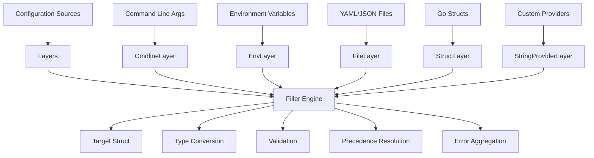

# WARP.md

This file provides guidance to WARP (warp.dev) when working with code in this repository.

dsco is a Go configuration library that provides a layered configuration system supporting command line arguments, environment variables, YAML files, and struct-based configurations with strict validation.

## Development Commands

### Build and Test
```bash
# Build all packages
go build ./...

# Run all tests with race detection and coverage
go test -race -cover ./...

# Run tests with verbose output
go test -v ./...

# Run specific package tests
go test ./internal/...

# Run specific test
go test -run TestFill ./...
```

### Linting and Code Quality
```bash
# Run golangci-lint with project configuration
golangci-lint run

# Format code with gofumpt
gofumpt -w .

# Fix line length issues (max 80 chars per project rules)
golines --shorten-comments --chain-split-dots --max-len=80 --base-formatter=gofumpt -w .

# Fix struct alignment issues (when golangci-lint detects them)
betteralign -apply ./...

# Generate mocks using mockery
mockery --all
```

### Validation Commands
```bash
# Ensure no golangci-lint issues remain
golangci-lint run --issues-exit-code=2

# Check for unused dependencies
go mod tidy

# Verify module integrity
go mod verify
```

## Architecture Overview

dsco implements a layered configuration system with the following key components:



### Configuration Flow

1. **Layer Registration**: Different configuration sources register as layers with optional strict/normal policies
2. **Model Generation**: Target struct is analyzed via reflection to create field mappings
3. **Value Collection**: Each layer provides field values based on its source (cmdline, env, etc.)
4. **Precedence Resolution**: Later layers override earlier ones, with strict mode detecting conflicts
5. **Type Conversion**: String values are converted to target types using YAML unmarshaling
6. **Validation**: Required fields and custom validation rules are applied
7. **Struct Filling**: Target struct is populated with final resolved values

## Key Interfaces

### Core Interfaces

```go
// Layer defines a configuration source that can register with the system
type Layer interface {
    register(to *layerBuilder) error
}

// FieldValuesGetter provides field values from a configuration source
type FieldValuesGetter interface {
    GetFieldValuesFrom(model ModelInterface) (fvalue.Values, error)
}

// StringValuesProvider provides string-based configuration values
type StringValuesProvider interface {
    GetStringValues() svalue.Values
}

// NamedStringValuesProvider extends StringValuesProvider with identification
type NamedStringValuesProvider interface {
    StringValuesProvider
    GetName() string
}
```

### Model Interface

```go
// ModelInterface represents the target configuration structure model
type ModelInterface interface {
    TypeName() string
    ApplyOn(g internal.ValueGetter) (fvalue.Values, error)
    Expand(g internal.StructExpander) error
    GetFieldValuesFor(id string, v reflect.Value) fvalue.Values
    Fill(inputModelValue reflect.Value, layers []fvalue.Values) (plocation.Locations, error)
}
```

## Layer Types and Usage

### Command Line Layers
- `WithCmdlineLayer(options...)`: Normal command line parsing
- `WithStrictCmdlineLayer(options...)`: Strict mode - all flags must be used
- Can only be used once per configuration
- Automatically parses `os.Args[1:]`

### Environment Variable Layers
- `WithEnvLayer(prefix, options...)`: Normal env var parsing
- `WithStrictEnvLayer(prefix, options...)`: Strict mode - all matching env vars must be used
- Multiple layers with different prefixes allowed
- Converts field names: `field.subfield` → `PREFIX_FIELD_SUBFIELD`

### Struct Layers
- `WithStructLayer(input, id)`: Normal struct-based configuration
- `WithStrictStructLayer(input, id)`: Strict mode - all struct fields must be used
- Input must be pointer to struct
- ID prevents duplicate struct usage

### String Provider Layers
- `WithStringValueProvider(provider, options...)`: Custom string value provider
- `WithStrictStringValueProvider(provider, options...)`: Strict version
- Allows integration with custom configuration sources

## Configuration Struct Patterns

### Field Declaration Rules
Based on project rules, configuration fields must follow specific patterns:

```go
type DatabaseConfig struct {
    // All fields must be pointers (except slices/maps)
    Host     *string `yaml:"host" json:"host,omitempty"`
    Port     *int    `yaml:"port" json:"port,omitempty"`
    
    // Slices and maps can be non-pointer
    Tables   []string          `yaml:"tables" json:"tables,omitempty"`
    Options  map[string]string `yaml:"options" json:"options,omitempty"`
    
    // Extensive documentation required
    // Timeout specifies the maximum connection duration in seconds.
    // If nil, defaults to 30 seconds.
    // Example: 10
    Timeout *int `yaml:"timeout" json:"timeout,omitempty"`
}
```

### Provider Function Pattern
```go
func NewDatabasePool(config *DatabaseConfig) (*DatabasePool, error) {
    // 1. Validate configuration
    if err := validateConfig(config); err != nil {
        return nil, fmt.Errorf("invalid config: %w", err)
    }
    
    // 2. Create component
    pool := &DatabasePool{}
    
    // 3. Copy config if provided
    if config != nil {
        pool.DatabaseConfig = *config // Embed, not pointer
    }
    
    return pool, nil
}
```

## Error Handling Patterns

### Custom Error Types
The library follows specific error patterns:

```go
// All custom errors have corresponding sentinel errors
var ErrInvalidInput = errors.New("")

type InvalidInputError struct {
    Type reflect.Type
}

func (InvalidInputError) Is(err error) bool {
    return errors.Is(err, ErrInvalidInput)
}

// Error messages describe context without function names
func (c InvalidInputError) Error() string {
    return fmt.Sprintf(
        "type %s is not a valid pointer on struct",
        registry.LongTypeName(c.Type),
    )
}
```

### Error Wrapping Pattern
```go
func someFunction() error {
    const errCtx = "configuration parsing: field validation"
    
    if err := validateField(); err != nil {
        return fmt.Errorf("%s: %w", errCtx, err)
    }
    
    return nil
}
```

## Testing Patterns

### Mock Generation
- Uses mockery tool with `.mockery.yaml` configuration
- Mocks generated in same package with `_test.go` suffix
- All interfaces automatically mocked

### Test Structure
```go
func TestFunctionName(t *testing.T) {
    t.Parallel()
    
    t.Run("success_case", func(t *testing.T) {
        t.Parallel()
        // Test implementation
    })
    
    t.Run("error_case", func(t *testing.T) {
        t.Parallel()
        // Test error handling using:
        // - testify.ErrorIs for error type checking
        // - testify.Contains for error message validation
        // - testify.ErrorAs for complex error types
    })
}
```

## Package Organization

### Core Packages
- `dsco`: Main package with public API
- `internal/`: Internal implementation packages
  - `cmdline/`: Command line argument parsing
  - `env/`: Environment variable handling
  - `model/`: Struct reflection and modeling
  - `fvalue/`: Field value representation
  - `merror/`: Multiple error aggregation

### Support Packages
- `svalue/`: String value representation
- `registry/`: Type name registry
- `ref/`: Reference utilities
- `hit/`: Hash-based utilities

### Example Packages
- `examples/deadsimple/`: Basic usage examples
- `examples/simplemain/`: Main function examples

## Common Development Tasks

### Adding New Layer Type
1. Implement `Layer` interface with `register()` method
2. Create builder function following naming pattern `WithXxxLayer()`
3. Add deduplication logic in `register()` method
4. Add comprehensive tests with success and error cases

### Adding New String Provider
1. Implement `StringValuesProvider` or `NamedStringValuesProvider`
2. Handle key conversion and aliasing
3. Provide location information for debugging
4. Test with both strict and normal modes

### Extending Validation
1. Custom validators implement specific interfaces
2. Error aggregation through `merror.MError`
3. Location tracking for precise error reporting
4. Test all error paths and edge cases

## Code Quality Standards

Based on project rules, ensure:
- Line length ≤ 80 characters
- All public functions/types documented with examples
- Error strings start lowercase, no trailing punctuation
- Use `math/rand/v2` instead of `math/rand`
- Prefer iterators over slices when avoiding allocation
- Consistent error wrapping with context